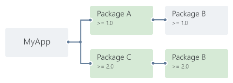
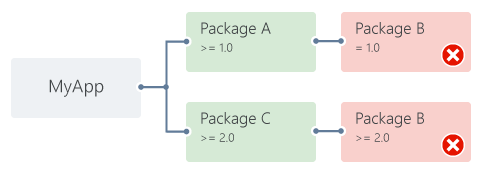

---
# required metadata

title: NuGet Package Dependency Resolution | Microsoft Docs
author: kraigb
ms.author: kraigb
manager: ghogen
ms.date: 2/8/2017
ms.topic: article
ms.prod: nuget
#ms.service:
ms.technology: null
ms.assetid: 1d530a72-3486-4a0d-b6fb-017524616f91

# optional metadata

description: Details on the process through which a NuGet package's dependencies are resolved and installed in both NuGet 2.x and NuGet 3.x+.
keywords: NuGet package dependencies, NuGet versioning, dependency versions, version graph, version resolution, transitive restore
#ROBOTS:
#audience:
#ms.devlang:
ms.reviewer:
- karann
- unnir
#ms.suite:
#ms.tgt_pltfrm:
#ms.custom:

---

# How NuGet resolves package dependencies

Any time a package is installed or reinstalled, which includes being installed as part of a [restore](../consume-packages/package-restore.md) process, NuGet also installs any additional packages on which that first package depends.

Those immediate dependencies might then also have dependencies on their own, which can continue to an arbitrary depth. This produces what's called a *dependency graph* that describes the relationships between packages are all levels.

When multiple packages have the same dependency, then the same package ID can appear in the graph multiple times, potentially with different version constraints. However, only one version of a given package can be used in a project, so NuGet must choose which version will be used.

The exact process differs between NuGet 2.x (using `packages.config`) and NuGet 3.x (using `project.json`) as described in the sections below.

In some cases, such as when there's a conflict between a dependency specified in one project and an assembly that's produced by another, it might be necessary to explicitly exclude a reference. The section [Excluding references](#excluding-references) below.

## Dependency resolution in NuGet 2.x

With NuGet 2.x, a project's dependencies are written to the `packages.config` file as a flat list. Any dependencies of those packages are also written in the same list, and NuGet might also modify `.csproj` file and possibly also `app.config`, `web.config`, and other individual files.

NuGet 2.x will attempt to resolve dependency conflicts during the installation of each individual package, which includes package restore. That is, if Package A is being installed and depends on Package B, and Package B is already listed in `packages.config` as a dependency of something else, NuGet will compare the versions of Package B being requested and attempt to find a version that will satisfy all version constraints. Specifically, NuGet will select the lower major.minor version that satisfies dependencies.

By default, NuGet 2.7 and earlier resolves the highest *patch* version (using the major.minor.patch.build convention). [NuGet 2.8](../release-notes/nuget-2.8.md#patch-resolution-for-dependencies) changes this behavior to look for the lowest patch version by default, and allows you to control this setting through the `DependencyVersion` attribute in `Nuget.Config` and the `-DependencyVersion` switch on the command line.  

On the downside, the NuGet 2.x process for resolving dependencies gets complicated for larger dependency graphs. This is especially true during package restore, because each new package installation requires a traversal of the whole graph and raises the chance for version conflicts. When a conflict occurs, package restoration is stopped, leaving the project in a partially-restored state, especially with potential modifications to the project file itself.

This and other challenges is why dependency resolution was overhauled in NuGet 3.x, as described in the next section.

## Dependency resolution in NuGet 3.x

As dependencies are installed into a project, NuGet 3.x adds them to a flat package graph in `project.json` in which conflicts are resolved ahead of time. This is referred to as *transitive restore*. Reinstalling or restoring packages is then simply a process of downloading the packages listed in the graph, resulting in faster and more predictable builds.

> [!Note]
> `project.json` is mandatory for UWP apps and ASP.NET 5 apps, is optional for PCLs, and currently is not fully supported on other project systems.


### Advantages of transitive restore

1. Developers explicitly declare which package versions they depend on, without worrying about their down-level dependencies.
1. Project files are not modified, avoiding merge conflicts and file churn on commits. This also allows the project system to evolve independent of NuGet.
1. Developers can easily change dependency versions without worrying about side effects on the rest of the project.
1. Hint paths are not being burned into the project files, fixing the ability to move projects around on disk, and re-targeting problems.
1. Direct support for Native or special dependencies can be determined directly by the project system. This is related to a new package format in NuGet 3.x.
1. Developers can specify a floating version range such as *2.8.\**, avoiding expensive and error prone calls to NuGet update on the client machines and build servers.

### Lock file and MSBuild

When the NuGet restore process runs prior to a build, it resolves dependencies first in memory, then writes the resulting graph to a file called `project.lock.json` alongside `project.json`. MSBuild then reads this file and translates it into a set of folders where potential references can be found, and then adds them to the project tree in memory.

The lock file is temporary and does not need to be added to source control; it's listed by default in both `.gitignore` and `.tfignore`.


### Dependency resolution rules

NuGet 3.x applies four main rules to resolve dependencies: lowest applicable version, floating versions, nearest-wins, cousin dependencies.

<a name="lowest-applicable-version"></a>

#### Lowest applicable version

NuGet 3.x restores the lowest possible version of a package as defined by its dependencies. This rule also applied to dependencies on the application or the class library unless declared as [floating](#floating-versions).

For example, in the following figure *1.0-Beta* is considered lower than *1.0* so NuGet chooses the 1.0 version:


In the next figure, version *2.1* is not available on the feed but because the version constraint is *>= 2.1* NuGet will pick the next lowest version it can find, in this case *2.2*:


When an application specifies an exact version number, such as *1.2*, that is not available on the feed, NuGet will fail with an error when attempting to install or restore the package:


<a name="floating-versions"></a>

#### Floating versions

A floating dependency version is specified with the * wildcard, as with *6.0.\** in the `project.json` file. This says "use the latest 6.0.x version"; a floating version of *4.\** means "use the latest 4.x version." Using a floating version allows a dependency package to continue evolving without requiring a change to the consuming application (or package).

When a floating version constraint is specified then NuGet will resolve the highest version of a package that matches the version pattern, for example *6.0.** will get the highest version of a package that starts with *6.0*:


<a name="nearest-wins"></a>

#### Nearest wins

When the package graph for an application contains different versions of the same package, the package that's closest to the application in the graph will be used and others will be ignored. This allows an application to override any particular package version in the dependency graph.

In the example below, the application depends directly on Package B with a version constraint of *>=2.0*. The application also depends on Package A which in turn also depends on Package B, but with a *>=1.0* constraint. Because the dependency on Package B *2.0* is nearer to the application in the graph, that version is used:


>[!Warning]
> Applying the Nearest Wins rule can downgrading the package version, thus potentially breaking other dependencies in the graph. This currently produces an error, although we are considering making it a warning instead. See [issue #897 on GitHub](https://github.com/NuGet/Home/issues/897).

This rule also results in greater efficiency with large dependency graph (such as those with the BCL packages) because by once a given dependency is ignored, NuGet also ignores all remaining dependencies on that branch of the graph. In the diagram below, for example, because Package C 2.0 will be used, NuGet can ignore any branches in the graph that refer to an older version of Package C:


<a name="cousin-dependencies"></a>

#### Cousin dependencies

When different package versions are referred to at the same distance in the graph from the application, NuGet uses the lowest version that satisfies all version requirements (as with the [lowest applicable version](#lowest-applicable-version) and [floating versions](#floating-versions) rules). In the image below, for example, version *2.0* of Package B will satisfy the other *>=1.0* constraint, and will thus be used:



In some cases, it is not possible to meet all version requirements. As shown below, if Package A requires exactly Package B *1.0* and Package C requires Package B *>=2.0*, then NuGet cannot resolve the dependencies and will give an error.



In these situations, the top-level consumer (the application or package) should add its own direct dependency on Package B so that the [Nearest Wins](#nearest-wins) rule applies.

## Excluding references

There are scenarios in which assemblies with the same name might be referenced more than once in a project, producing design-time and build-time errors. For example, consider a project that contains a custom version of `C.dll`, and references packageC that also contains `C.dll`. At the same time, the project also depends on packageB which also depends on packageC and `C.dll`. As a result, NuGet won't be able to determine which `C.dll` to use, but you can't just remove the project's dependency on packageC because packageB also depends on it.

To resolve this, you must directly reference the `C.dll` you want (or use another package that references the right one), and then add a dependency on packageC that excludes all its assets. This is done as follows:

- If you're project is using `packages.config` for tracking NuGet dependencies, simply remove the reference to packageC from the `.csproj` file so that it references only the version of `C.dll` that you want.
    
- If your project uses `project.json` for NuGet, add `"exclude" : "all"` in the dependency for packageC:

    ```json
    {
        "dependencies": {
            "packageC": {
            "version": "1.0.0",
            "exclude": "all"
            }
        }
    }
    ```

- With [package references in project files](../consume-packages/package-references-in-project-files.md) (NuGet 4.0+ only), add `Exclude="All"` in the dependency:

    ```xml
    <PackageReference Include="packageC" Version="1.0.0" Exclude="All" />
    ```
