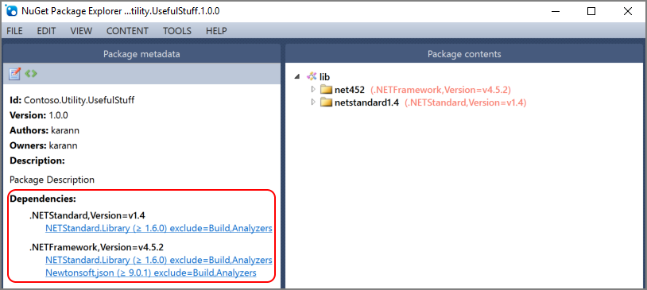

---
# required metadata

title: NuGet PackageReference in Visual Studio Project Files | Microsoft Docs
author: kraigb
ms.author: kraigb
manager: ghogen
ms.date: 7/17/2017
ms.topic: article
ms.prod: nuget
#ms.service:
ms.technology: null
ms.assetid: 5a554e9d-1266-48c2-92e8-6dd00b1d6810

# optional metadata

description: Details on NuGet PackageReference in project files as supported by NuGet 4.0+ and VS2017
keywords: NuGet package dependencies, package references, project files, PackageReference, packages.config, project.json, VS2017, Visual Studio 2017, NuGet 4
#ROBOTS:
#audience:
#ms.devlang:
ms.reviewer:
- karann-msft
- unniravindranathan
#ms.suite:
#ms.tgt_pltfrm:
#ms.custom:

---
# Package references (PackageReference) in project files

Package references, using the `PackageReference` node, allow you to manage NuGet dependencies directly within project files, rather than needing a separate `packages.config` or `project.json` file. This method doesn't affect other aspects of NuGet; for example, settings in `NuGet.Config` files (including package sources) are still applied as explained in [Configuring NuGet Behavior](Configuring-NuGet-Behavior.md).

> [!Important]
> At present, package references are supported in Visual Studio 2017 only, for .NET Core projects, .NET Standard projects, and UWP projects targeting Windows 10 Build 15063 (Creators Update).

The `PackageReference` approach allows you to use MSBuild conditions to choose package references per target framework, configuration, platform, or other groupings. It also allows for fine-grained control over dependencies and content flow. In terms of behavior and [dependency resolution](Dependency-Resolution.md), it's the same as using `project.json`.

For more details on the integration of MSBuild with package references in project files, see [NuGet pack and restore as MSBuild targets](../schema/msbuild-targets.md).

## Adding a PackageReference

Add a dependency in your project file using the following syntax:

```xml
<ItemGroup>
    <!-- ... -->
    <PackageReference Include="Contoso.Utility.UsefulStuff" Version="3.6.0" />    
    <!-- ... -->
</ItemGroup>
```

## Controlling dependency version

The convention for specifying the version of a package is the same as when using `packages.config` or `project.json`:

```xml
<ItemGroup>
    <!-- ... -->
    <PackageReference Include="Contoso.Utility.UsefulStuff" Version="3.6.0" />
    <!-- ... -->
</ItemGroup>
```

In the example above, 3.6.0 means any version that is >=3.6.0 with preference for the lowest version, as described on [Package versioning](../reference/package-versioning.md#version-ranges-and-wildcards).

## Floating Versions

[Floating versions](../consume-packages/dependency-resolution.md#floating-versions) are supported with `PackageReference`:

```xml
<ItemGroup>
    <!-- ... -->
    <PackageReference Include="Contoso.Utility.UsefulStuff" Version="3.6.*" />
    <PackageReference Include="Contoso.Utility.UsefulStuff" Version="3.6.0-beta*" />
    <!-- ... -->
</ItemGroup>
```

## Controlling dependency assets

You might be using a dependency purely as a development harness and might not want to expose that to projects that will consume your package. In this scenario, you can use the `PrivateAssets` metadata to control this behavior.

```xml
<ItemGroup>
    <!-- ... -->

    <PackageReference Include="Contoso.Utility.UsefulStuff" Version="3.6.0">
        <PrivateAssets>all</PrivateAssets>
    </PackageReference>

    <!-- ... -->
</ItemGroup>
```

The following metadata tags control dependency assets:

| Tag | Description | Default Value |
| --- | --- | --- |
| IncludeAssets | These assets will be consumed | all |
| ExcludeAssets | These assets will not be consumed | none | 
| PrivateAssets | These assets will be consumed but won't flow to the parent project | contentfiles;analyzers;build |


Allowable values for these tags are as follows, with multiple values separated by a semicolon except with `all` and `none` which must appear by themselves:

| Value | Description |
| --- | ---
| compile | Contents of the `lib` folder |
| runtime | Contents of the `runtime` folder |
| contentFiles | Contents of the `contentfiles` folder |
| build | Props and targets in the `build` folder |
| analyzers | .NET analyzers |
| native | Contents of the `native` folder |
| none | None of the above are used. |
| all | All of the above (except `none`) |

In the following example, everything except the content files from the package would be consumed by the project and everything except content files and analyzers would flow to the parent project.

```xml
<ItemGroup>
    <!-- ... -->

    <PackageReference Include="Contoso.Utility.UsefulStuff" Version="3.6.0">
        <IncludeAssets>all</IncludeAssets>
        <ExcludeAssets>contentFiles</ExcludeAssets>
        <PrivateAssets>contentFiles;analyzers</PrivateAssets>
    </PackageReference>

    <!-- ... -->
</ItemGroup>
```

Note that because `build` is not included with `PrivateAssets`, targets and props *will* flow to the parent project. Consider, for example, that the reference above is used in a project that builds a NuGet package called AppLogger. AppLogger can consume the targets and props from `Contoso.Utility.UsefulStuff`, as can projects that consume AppLogger.

## Adding a PackageReference condition

You can use a condition to control whether a package is included, where conditions can use any MSBuild variable or a variable defined in the targets or props file. However, at presently, only the `TargetFramework` variable is supported.

For example, say you're targeting `netstandard1.4` as well as `net452` but have a dependency that is applicable only for `net452`. In this case you don't want a `netstandard1.4` project that's consuming your package to add that unnecessary dependency. To prevent this, you specify a condition on the `PackageReference` as follows:

```xml
<ItemGroup>
    <!-- ... -->
    <PackageReference Include="Newtonsoft.json" Version="9.0.1" Condition="'$(TargetFramework)' == 'net452'" />    
    <!-- ... -->
</ItemGroup>
```

A package built using this project will show that Newtonsoft.json is included as a dependency only for a `net452` target:



Conditions can also be applied at the `ItemGroup` level and will apply to all children `PackageReference` elements:

```xml
<ItemGroup Condition = "'$(TargetFramework)' == 'net452'">
    <!-- ... -->
    <PackageReference Include="Newtonsoft.json" Version="9.0.1" />
    <PackageReference Include="Contoso.Utility.UsefulStuff" Version="3.6.0" />
    <!-- ... -->
</ItemGroup>
```
