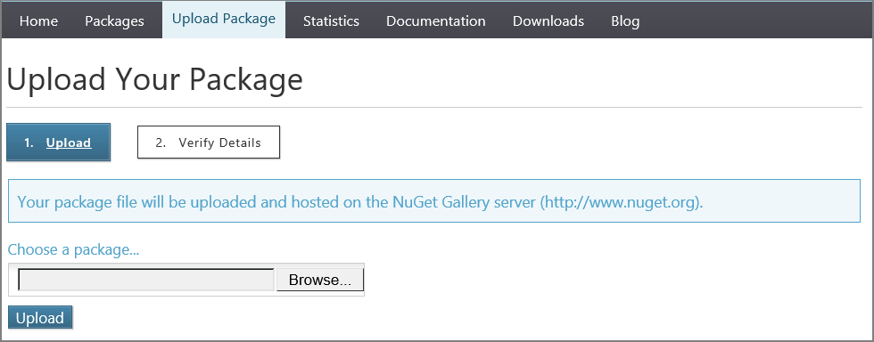

---
# required metadata

title: Publishing a NuGet Package | Microsoft Docs
author: kraigb
ms.author: kraigb
manager: ghogen
ms.date: 1/9/2017
ms.topic: article
ms.prod: nuget
#ms.service:
ms.technology: nuget
ms.assetid: 2342aabd-983e-4db1-9230-57c84fa36969

# optional metadata

#description:
#keywords:
#ROBOTS:
#audience:
#ms.devlang:
ms.reviewer:
- karann
- harikm
#ms.suite:
#ms.tgt_pltfrm:
#ms.custom:

---
#Publish a Package

Once you have [created a package](../create-packages/creating-a-package.md) with `nuget pack`, it's a simple process to make it available to other developers, either publicly or privately:

- Public packages are made available to all developers globally through [nuget.org](https://www.nuget.org/packages/manage/upload). See instructions below.
- Private packages are available to only a team or organization, by hosting them either a file share, a private NuGet server, Visual Studio Team Services package management, or a third- party repository such as myget, ProGet, Nexus Repository, and Artifactory. For additional details, see [Hosting Packages Overview](../hosting-packages/overview.md))

##Publish to nuget.org

For nuget.org, you must first [register for a free account](https://www.nuget.org/users/account/LogOn?returnUrl=%2F) or sign in if already registered:

Next, you can either upload the package through the nuget.org web portal, or push to nuget.org from the command line:

- Web portal: use the Upload Package tab on nuget.org:

    

- Command line:
    1. Click on your user name to navigate to your account settings.
    2. Under **API Key**, click **copy to clipboard** to retrieve the access key you'll need in the CLI:

        

    3. At a command prompt, run the following command:

            nuget setApiKey Your-API-Key

        This will store your API key on the machine so that you will not need to do this step again on the same machine.

    4. Push your package to NuGet Gallery using the command:

            nuget push YourPackage.nupkg -Source https://www.nuget.org/api/v2/package

    5. Before being made public, all packages uploaded to nuget.org are scanned for viruses and rejected if any viruses are found. All packages listed on nuget.org are also scanned periodically.

    6. In your account on nuget.org, click **Manage my packages** to see the one that you just published; you'll also receive a confirmation email. Note that it might take a while for your package to be indexed and appear in search results where others can find it, during which time you'll see the following message on your package page:

        

## Managing package owners on nuget.org

Although each NuGet package's `.nuspec` file defines the package's authors, the nuget.org gallery does not use that metadata to define ownership. Instead, nuget.org assigns initial ownership to the person who publishes the package. This will be either the logged-in user who uploaded the package through the nuget.org UI, or the users whose API key was used with `nuget SetApiKey` or `nuget push`.

All package owners have full permissions for the package, including adding and removing other owners, and publishing updates.

To change ownership of a package, do the following:

1. Sign in to nuget.org with the account that is the current owner of the package.
1. Click on your username, then on **Manage my packages**, then on the package you want to manage.
1. Click the **Manage owners** link on the left side.

From here you have several options:

1. To add an owner, enter their NuGet account name and click **Add**. This sends an email to that new co-owner with a confirmation link. Once confirmed, that person has full permissions to add and remove owners. (Until confirmed, the **Manage owners** page will indicate "pending approval" for that person).
1. To remove an owner, select their name on the **Manage owners** and click **Remove**.
1. To transfer ownership (as when ownership changes or a package was published under the wrong account), simply add the new owner, and once they've confirmed ownership they can remove you from the list.

To assign ownership to a company or group, create a nuget.org account using an email alias that is forwarded to the appropriate team members. For example, various Microsoft ASP.NET packages are co-owned by the [microsoft](http://nuget.org/profiles/microsoft) and [aspnet](http://nuget.org/profiles/aspnet) accounts, which simply such aliases.

### Recovering package ownership

Occasionally, a package may not have an active owner. For example, the original owner may have left the company that produces the package, nuget.org credentials are lost, or earlier bugs in the gallery left a package ownerless.

If you are the rightful owner of a package and need to regain ownership, use the [contact form](https://www.nuget.org/policies/Contact) on nuget.org to explain your situation to the NuGet team. We will then follow a process to verify your ownership of the package, including trying to locate the existing owner through the package's Project URL, Twitter, email, or other means. But if all else fails, we can send you a new invite to become an owner.
