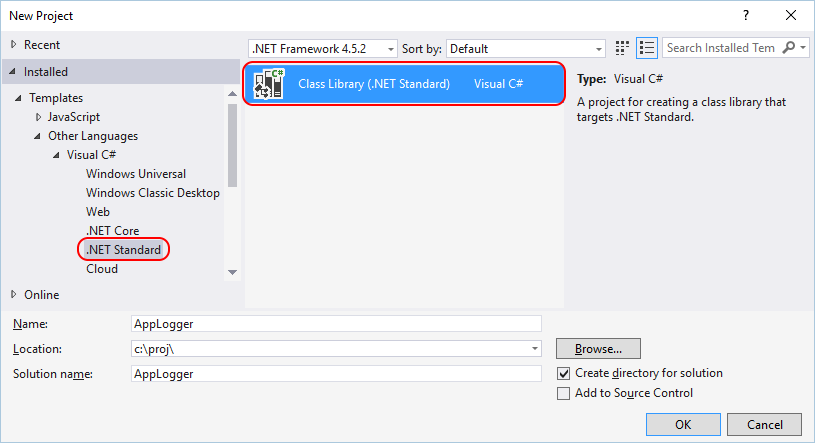
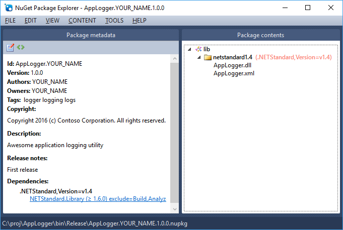

---
# required metadata

title: Create .NET Standard NuGet Packages with Visual Studio 2017 | Microsoft Docs
author: kraigb
ms.author: kraigb
manager: ghogen
ms.date: 2/8/2017
ms.topic: article
ms.prod: nuget
#ms.service:
ms.technology: null
ms.assetid: 2c1de334-fdc9-4e1e-8ef6-a90b3e77ff0f

# optional metadata

description: An end-to-end walkthrough of creating .NET standard NuGet packages using NuGet 4.x and Visual Studio 2017.
keywords: create a package, .NET Standard packages, .NET Core
#ROBOTS:
#audience:
#ms.devlang:
ms.reviewer:
- karann
- unnir
#ms.suite:
#ms.tgt_pltfrm:
#ms.custom:

---

# Create .NET standard packages with Visual Studio 2017

*Applies to NuGet 4.x+ and MSBuild 15.1+ as provided with Visual Studio 2017. See [Create .NET Standard Packages with Visual Studio 2015](../guides/create-net-standard-packages-vs2015.md) for working with NuGet 3.x+*

The [.NET Standard Library](https://docs.microsoft.com/dotnet/articles/standard/library) is a formal specification of .NET APIs intended to be available on all .NET runtimes, thus establishing greater uniformity in the .NET ecosystem. The .NET Standard Library defines a uniform set of BCL (Base Class Library) APIs for all .NET platforms to implement, independent of workload. It enables developers to produce PCLs that are usable across all .NET runtimes, and reduces if not eliminates platform-specific conditional compilation directives in shared code.

This guide will walk you through creating a nuget package targeting .NET Standard Library 1.4 with Visual Studio 2017 and NuGet 4.0.

1. [Pre-requisites](#pre-requisites)
1. [Create the class library project](#create-the-net-core-class-library-project)
1. [Edit metadata in the .csproj file](#edit-metadata-in-the-csproj-file)
1. [Package the component](#package-the-component)
1. [Related topics](#related-topics)

## Pre-requisites

This walkthrough requires Visual Studio 2017 with the **.NET Core cross-platform development** workload. You can install the Community edition for free from [visualstudio.com](https://www.visualstudio.com/), or use the Professional and Enterprise editions.

The require workload appears as follows in the Visual Studio installer:


## Create the .NET Standard class library project

1. In Visual Studio, **File > New > Project**, expand the **Visual C# > .NET Standard** node, select **Class Library (Net Standard)**, change the name to AppLogger, and click OK.

    

1. Change the build configuration to **Release**.
1. Right-click the `AppLogger (Portable)` in Solution Explorer, select **Properties**, select the **Build** tab, check the box for **XML documentation file**, and set the filename to just `AppLogger.xml`. Then save the project.

1. Add your code to the component, for example:

    ```cs
    namespace AppLogger
    {
        public class Logger
        {
            public void Log(string text)
            {
                throw new NotImplementedException("Called Log");
            }
        }
    }
    ```

1. Build the project (with the Release configuration) and check that DLL and XML files are produced within the `bin\Release\netstandard1.4` folder.

## Edit metadata in the .csproj file

With NuGet 4.0 and .NET Core projects, package metadata is contained directly in the `.csproj` file instead of external files such as a `.nuspec`. A full description of that metadata is found in [NuGet pack and restore as MSBuild targets](../schema/msbuild-targets.md#pack-target).

1. Right-click the project in Solution Explorer, select **Edit AppLogger.csproj**, and then edit the first property group to include package information such as the following:

    ```xml
    <PropertyGroup>
        <TargetFramework>netstandard1.4</TargetFramework>
        <PackageId>AppLogger.YOUR_NAME</PackageId>
        <PackageVersion>1.0.0</PackageVersion>
        <Authors>YOUR_NAME</Authors>
        <Description>Awesome application logging utility</Description>
        <PackageRequireLicenseAcceptance>false</PackageRequireLicenseAcceptance>
        <PackageReleaseNotes>First release</PackageReleaseNotes>
        <Copyright>Copyright 2016 (c) Contoso Corporation. All rights reserved.</Copyright>
        <PackageTags>logger logging logs</PackageTags>
    </PropertyGroup>
    ```

1. Save the project, then right-click the solution and select **Build Solution** to again generate all the files for the package, this time with the correct metadata.


## Package the component

NuGet 4.0 supports a pack target using MSBuild version 15.1+ when the project contains the necessary package metadata, as was added in the previous section. To invoke MSBuild in this way, simply specify the pack target on the command line in the same folder as the `.csproj` file:

    msbuild /t:pack /p:Configuration=Release

For additional options with `msbuild /t:pack`, such as including content files, symbols, and source code, see [NuGet pack and restore as MSBuild targets](../schema/msbuild-targets.md#pack-target).

In any case, the command above generates `AppLogger.YOUR_NAME.1.0.0.nupkg` in the `bin\Release` folder by default, as it builds that configuration. If you omit the `/p` switch, the default configuration will be `Debug`. 

Opening this file in a tool like the [NuGet Package Explorer](https://github.com/NuGetPackageExplorer/NuGetPackageExplorer) and expanding all the nodes, you'll see the following contents:



> [!Tip]
> A `.nupkg` file is just a ZIP file with a different extension. You can also examine package contents, then, by changing `.nupkg` to `.zip`, but remember to restore the extension before uploading a package to nuget.org.

To make your package available to other developers,  follow the instructions on [Publish a package](../create-packages/publish-a-package.md).

## Related topics

- [Package References in Project Files](../consume-packages/package-references-in-project-files.md)
- [NuGet pack and restore as MSBuild targets](../schema/msbuild-targets.md)
- [.NET Standard Library documentation](https://docs.microsoft.com/dotnet/articles/standard/library)
- [Porting to .NET Core from .NET Framework](https://docs.microsoft.com/dotnet/articles/core/porting/index)
