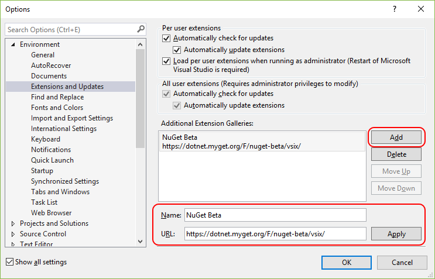
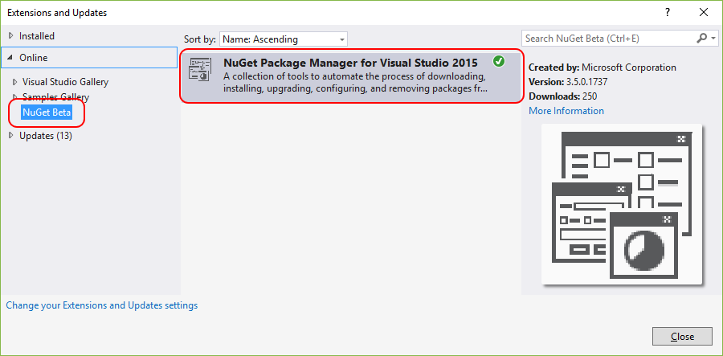

--- 
# required metadata 
 
title: “Installing NuGet | Microsoft Docs” 
author: kraigb 
ms.author: kraigb 
manager: ghogen 
ms.date: 11/11/2016 
ms.topic: article 
ms.prod: nuget 
#ms.service: 
ms.technology: nuget 
ms.assetid: 683b8b34-a6f4-4d56-b9cd-2483bfbad1ad 
 
# optional metadata 
 
#description: 
#keywords: 
#ROBOTS: 
#audience: 
#ms.devlang: 
ms.reviewer:  
- karann 
- harikm 
#ms.suite:  
#ms.tgt_pltfrm: 
#ms.custom: 
 
---

# Installing NuGet

There are two primary tools available to help you build, publish and consume NuGet packages:

1. The [**NuGet CLI**](#nuget-cli) is the command-line utility that works on Windows, Mac OS X, and Linux and supports all NuGet capabilities.
1. The [**NuGet Package Manager  in Visual Studio**](#nuget-package-manager-in-visual-studio) is a GUI tool for managing packages and includes a console through which you can use certain NuGet commands directly within Visual Studio. It's included with Visual Studio 2012 and later and can be installed manually for earlier versions.

Both support the following operations:

- Search packages
- Install packages
- Update packages
- Uninstall packages
- Restore packages (UI only in the Package Manager)
- Manage NuGet sources

The following capabilities are supported only in the NuGet CLI:

- Manage packages (nuget.org or private feed)
- Create packages 
- Publish packages
- Manage nuget.config
- Manage the NuGet cache
- Replication a package

> [!Note]
> You might also be interested in the [NuGet Package Explorer](https://github.com/NuGetPackageExplorer/NuGetPackageExplorer), an open-source, stand-alone tool to visually explore and create NuGet packages.
> Also, the cross-platform [.NET Core CLI](https://docs.microsoft.com/dotnet/articles/core/tools/index#installation) toolchain for developing .NET Core applications also supports a [dotnet restore](https://docs.microsoft.com/en-us/dotnet/articles/core/tools/dotnet-restore) command that performs a nuget restore. No other nuget commands are available in the .NET Core CLI at present, however. 

## NuGet CLI

The NuGet CLI can be installed using any of the following methods:

1. **nuget.org**: Download the latest version of the nuget.exe file from [nuget.org/downloads](https://nuget.org/downloads) and save it to an appropriate location on your machine. If desired, add that location to your PATH environment variable so you can NuGet from anywhere. (Note that the download is a single .exe file, so save it rather than running it from the browser.)

> [!Note]
> With NuGet 1.4+, you can use `nuget update -self` to update your existing nuget.exe to the latest version.

1. **Chocolatey**: Install the [NuGet.CommandLine](http://chocolatey.org/packages/NuGet.CommandLine) Chocolatey package using the [Chocolatey](http://chocolatey.org) client. 

        choco install nuget.commandline

1. **Visual Studio**: Install the [NuGet.CommandLine](http://www.nuget.org/packages/NuGet.CommandLine/) package from the Package Manager Console in Visual Studio.

> **NuGet 2.x users**
> Because there are a few breaking changes introduced in NuGet 3.2, [https://nuget.org/nuget.exe](https://nuget.org/nuget.exe) points to the latest stable NuGet 2.x release to prevent CI systems from potentially breaking at this time.

### Compatibility with Mono

Though not fully-supported as yet, the NuGet command-line executable (version 3.2 and above) will run on Mac OS X and Linux systems when the Mono runtime is installed with a few limitations:

- Commands tested to work:
    - Config
    - Delete
    - Help
    - Install
    - List
    - Push
    - SetApiKey
    - Sources
    - Spec
- Partially-working commands:
    - Pack: works with .nuspec files but not with project files.
    - Restore: works with packages.config and project.json files but not with solution (.sln) files.
- Commands that do not work:
    - Update

### Related topics

- [NuGet CLI reference](../tools/nuget.exe-cli-reference.md)
- [Creating a package](../create-packages/creating-a-package.md)
- [Publishing a Package](../create-packages/publish-a-package.md)

## NuGet Package Manager in Visual Studio

The NuGet Package Manager is included in every edition of Visual Studio 2012 and later. It includes the Package Manager UI ([reference](../tools/package-manager-ui.md)) and the Package Manager Console, through which you can access tools that come with certain packages ([reference](../tools/package-manager-console.md)).

> [!Note]
> The console requires [PowerShell 2.0](http://support.microsoft.com/kb/968929), which will already be installed on Windows 7 or higher and Windows Server 2008 R2 or higher.
> Package Manager Console commands also work only within  Visual Studio. Use the NuGet CLI outside of that environment.

### Package Manager installation for Visual Studio 2010 and earlier

1. In Visual Studio, click **Tools > Extension and Updates**.
1. Navigate to **Online**, search for "NuGet Package Manager for Visual Studio," and click **Download**.
1. In the Installer dialog box, click **Install**.
1. When installation is complete, restart Visual Studio.

### Updating the Package Manager

For Visual Studio 2015 Update 2 and later, the Package Manager is automatically updated to the latest stable release.

For earlier versions of Visual Studio, select the **Tools > Extensions and Updates** command and click on the **Updates** tab to see if a new version of the Package Manager is available.  

### NuGet Beta Channel

The NuGet Beta Channel for the NuGet Package Manager in Visual Studio 2015 gives you access to high-quality builds that are close to completion. We use this channel to gather feedback on our near-final builds, and it's recommended for developers who want to try out new features and those who are experiencing blocking issues and need early access to updated builds before RTM. 

Accessing the beta channel is simple:

1. In Visual Studio, navigate to **Tools > Options > Environment > Extensions and Updates**, then add the feed `https://dotnet.myget.org/F/nuget-beta/vsix/` to the **Additional Extension Galleries** list:

    

1. Navigate to **Tools > Extensions and Updates** and select **Online**, which should show the NuGet-Beta Feed from which you can install a beta NuGet Package Manager:

    

To report problems with the Beta builds or to share ideas, open an issue on the [NuGet GitHub repository](https://github.com/Nuget/Home).

### Related topics

- [Package Manager UI reference](../tools/package-manager-ui.md)
- [Package Manager Console reference](../tools/package-manager-console.md)
- [Package Manager Console PowerShell reference](../tools/powershell-reference.md)