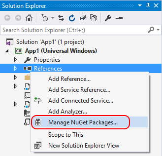
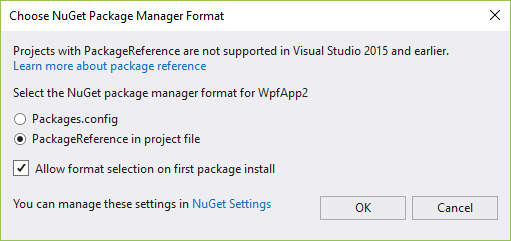
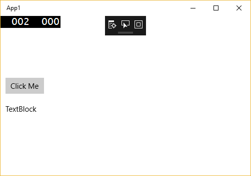
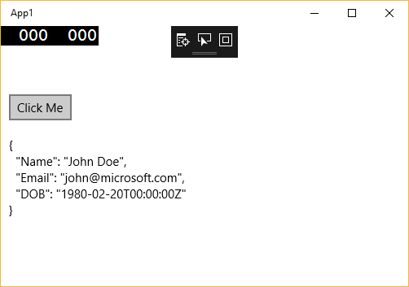

---
# required metadata

title: Introductory Guide to Using NuGet Packages | Microsoft Docs
author: kraigb
ms.author: kraigb
manager: ghogen
ms.date: 10/4/2017
ms.topic: get-started-article
ms.prod: nuget
ms.technology: null
ms.assetid: f31f8259-20a8-4617-880e-5819299372d2

# optional metadata

description: A walkthrough tutorial on the process of installing and using a NuGet package in a project.
keywords: install NuGet, NuGet package consumption, installing NuGet packages, NuGet package references, using NuGet packages
ms.reviewer:
- karann-msft
- unniravindranathan

---

# Install and use a package

Installing a package happens in three ways:

| Method | Description | Reference |
| --- | --- | --- | 
| nuget.exe CLI: `nuget install <package_name>` | Downloads the package identified by \<package_name\> and expands its contents into a folder in the current directory. No changes are made to any project files. Dependencies are also downloaded and expanded. | [CLI reference](../tools/nuget-exe-CLI-Reference.md) |
| Package Manager Console (Visual Studio): `Install-Package <package_name>` | Downloads and installs the package into the current project, then update the project file to list the package as a dependency. | [Package Manager Console Guide](../tools/Package-Manager-Console.md) |
| Package Manager UI (Visual Studio) | Provides a UI through which you can browse, select, and install packages into a project. Updates the project file to list the package as a dependency. | [Package Manager UI Reference](../tools/Package-Manager-UI.md) |

Once installed, refer to the package in code with `using <namespace>` where \<namespace\> is specific to the package you're using. Once the reference is made, you can call the package through its API.

The remainder of this topic walks through the process of using the Package Manager UI to install the popular [Newtonsoft.Json](https://www.nuget.org/packages/Newtonsoft.Json/) package in a Universal Windows Platform (UWP) project. It then shows an example of using the package. You use a similar same workflow for virtually every NuGet package you use in a project.

- [Install pre-requisites](#install-pre-requisites)
- [Create a project](#create-a-project)
- [Add the Newtonsoft.Json NuGet package](#add-the-newtonsoftjson-nuget-package)
- [Use the Newtonsoft.Json API in the app](#use-the-newtonsoftjson-api-in-the-app)

> [!Tip]
> **Start with nuget.org**: Installing packages from nuget.org is a common workflow that .NET developers use to find components they can reuse in their own applications. You can always search nuget.org directly or find and install packages within Visual Studio as shown in this topic.

## Install pre-requisites

This tutorial requires Visual Studio 2015 Update 3 with Tools for Universal Windows Apps, or Visual Studio 2017 with the Universal Windows Platform development workload. If you already have Visual Studio installed, you can run the installer again to add the UWP tools.

You can install the Community edition for free from [visualstudio.com](https://www.visualstudio.com/) or use the Professional or Enterprise editions. 

## Create a project

To install a NuGet package, you need some kind of .NET-based project in Visual Studio. For this walkthrough, you can use use a simple Windows Presentation Foundation (WPF) or Universal Windows (UWP) app:

- For WPF (Windows 7+), choose **File > New > Project**, expand **Visual C#**, select **Windows Classic Desktop > WPF App (.NET Framework)**, and select **OK**.
- For UWP (Windows 10), use the **Windows Universal > Blank App (Universal Windows)** instead. Accept the default values for Target Version and Minimum Version when prompted.

## Add the Newtonsoft.Json NuGet package

1. In Solution Explorer, right-click **References** and choose **Manage NuGet Packages**.

    

1. Choose "nuget.org" as the **Package source**, select the **Browse** tab, search for **Newtonsoft.Json**, select that package in the list, and select **Install**:

    

1. If prompted to select a package management format, choose between PackageReference (recommended) and `packages.config`:

    

1. If prompted to review changes, select **OK**.

1. Right-click the solution in Solution Explorer and select **Build Solution**. This restores any NuGet packages listed under **References**. For more details, see [Package Restore](../consume-packages/package-restore.md).

## Use the Newtonsoft.Json API in the app

With the Newtonsoft.Json package in the project, you can call its `JsonConvert.SerializeObject` method to convert an object to a human-readable string.

1. Open `MainWindow.xaml` (WPF) or `MainPage.xaml` (UWP) and replace the existing `Grid` element with the following:

    ```xaml
    <Grid Background="{ThemeResource ApplicationPageBackgroundThemeBrush}">
        <StackPanel VerticalAlignment="Center">
            <Button Click="Button_Click" Content="Click Me" Margin="10"/>
            <TextBlock Name="TextBlock" Text="TextBlock" Margin="10"/>
        </StackPanel>
    </Grid>
    ```

1. Expand the `MainWindow.xaml` (WPF) or `MainPage.xaml` (UWP) node in Solution Explorer, open the `.cs` file, and insert the following code inside the `MainWindow` or `MainPage` class, after the constructor:

    ```cs
    public class Account
    {
        public string Name { get; set; }
        public string Email { get; set; }
        public DateTime DOB { get; set; }
    }

    private void Button_Click(object sender, RoutedEventArgs e)
    {
        Account account = new Account
        {
            Name = "John Doe",
            Email = "john@microsoft.com",
            DOB = new DateTime(1980, 2, 20, 0, 0, 0, DateTimeKind.Utc),
        };
        string json = JsonConvert.SerializeObject(account, Formatting.Indented);
        TextBlock.Text = json;
    }
    ```

1. Even though you added the Newtonsoft.Json package to the project, red squiggles appears under `JsonConvert` because you need a `using` statement. Hover over the underlined `JsonConvert` and you'll see the Lightbulb and the option to **Show potential fixes**:

    


1. Click on **Show potential fixes** (or the Lightbulb) and select the first suggested fix, `using Newtonsoft.Json;`. This adds the necessary line to the top of the file.

    

1. Build and run the app by pressing F5 or selecting **Debug > Start Debugging** (UWP shown here; WPF is similar):

    

1. Select on the button to see the contents of the TextBlock replaced with some JSON text:

    

## Related topics

- [Overview and workflow of package consumption](../consume-packages/overview-and-workflow.md)
- [Finding and choosing packages](../consume-packages/finding-and-choosing-packages.md)
- [Configuring NuGet Behavior](../consume-packages/configuring-nuget-behavior.md)
