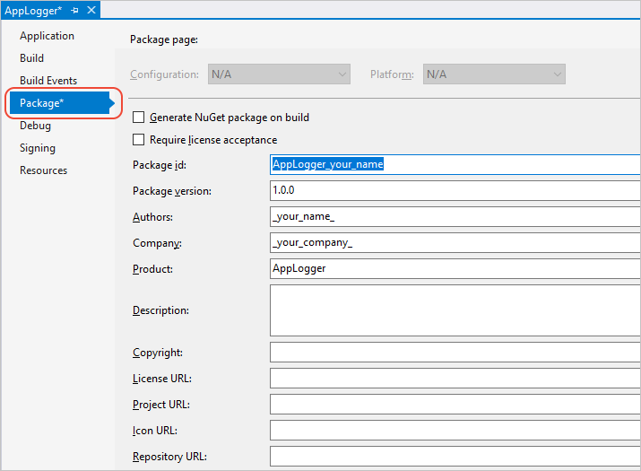

# Create and publish a package using Visual Studio

It's a simple process to create a NuGet package from a .NET Class Library in Visual Studio, and then publish it to nuget.org using a CLI tool.

## Pre-requisites

1. Install any edition of Visual Studio 2017 from [visualstudio.com](https://www.visualstudio.com/) with any .NET-related workload. Visual Studio 2017 automatically includes NuGet capabilities when a .NET workload is installed.

1. Install the `nuget.exe` CLI by downloading it from [nuget.org](https://dist.nuget.org/win-x86-commandline/latest/nuget.exe), saving that `.exe` file to a suitable folder, and adding that folder to your PATH environment variable.

    Alternately, if you have the [.NET Core SDK](https://www.microsoft.com/net/download/) installed, you can use the `dotnet` CLI.

1. [Register for a free account on nuget.org](https://www.nuget.org/users/account/LogOn?returnUrl=%2F) if you don't have one already. Creating a new account sends a confirmation email. You must confirm the account before you can upload a package.

## Create a class library project

You can use an existing .NET Class Library project for the code you want to package, or create a simple one as follows:

1. In Visual Studio, choose **File > New > Project**, expand the **Visual C# > .NET Standard** node, select the "Class Library (.NET Standard)" template, name the project AppLogger, and click **OK**.

1. Right-click on the resulting project file and select **Build** to make sure the project was created properly. The DLL is found within the Debug folder (or Release if you build that configuration instead).

Within a real NuGet package, of course, you implement many useful features with which others can build applications. For this walkthrough, however, you won't write any additional code because a class library from the template is sufficient to create a package.

> [!Tip]
> Unless you have a reason to choose otherwise, .NET Standard is the preferred target for NuGet packages, as it provides compatibility with the widest range of consuming projects.

## Configure package properties

1. Select the **Project > Properties** menu command, then select the **Package** tab:

    

    > [!Note]
    > For packages built for public consumption, pay special attention to the **Tags** property, as tags help others find your package and understand what it does.

1. Give your package a unique identifier and fill out any other desired properties. For a description of the different properties, see [.nuspec file reference](../schema/nuspec.md). All of the properties here go into the `.nuspec` manifest that Visual Studio creates for the project.

    > [!Important]
    > You must give the package an identifier that's unique across nuget.org or whatever host you're using. For this walkthrough we recommend including "Sample" or "Test" in the name as the later publishing step does make the package publicly visible (though it's unlikely anyone will actually use it).
    >
    > If you attempt to publish a package with a name that already exists, you'll see an error. 


## Run the pack command

1. Right click the project in **Solution Explorer** and select the **Pack** command:

    

1. Visual Studio builds the project and creates the `.nupkg` file. Examine the **Output** window for details (similar to the following), which contains the path to the package file:

    ```output
    1>------ Build started: Project: AppLogger, Configuration: Debug Any CPU ------
    1>AppLogger -> d:\proj\AppLogger\AppLogger\bin\Debug\netstandard2.0\AppLogger.dll
    1>Successfully created package 'd:\proj\AppLogger\AppLogger\bin\Debug\AppLogger.1.0.0.nupkg'.
    ========== Build: 1 succeeded, 0 failed, 0 up-to-date, 0 skipped ==========
    ```

## Publish the package

Once you have a `.nupkg` file, you publish it to nuget.org using either the `nuget.exe` CLI or the `dotnet.exe` CLI along with an API key acquired from nuget.org.

[!INCLUDE[publish-notes](includes/publish-notes.md)]

### Acquire your API key

[!INCLUDE[publish-api-key](includes/publish-api-key.md)]

### Publish with nuget push

This step is an alternative to using `dotnet.exe`.

1. Change to the folder containing the `.nupkg` file..

1. Run the following command, specifying your package name and replacing the key value with your API key:

    ```cli
    nuget push AppLogger.1.0.0.nupkg qz2jga8pl3dvn2akksyquwcs9ygggg4exypy3bhxy6w6x6 -Source https://api.nuget.org/v3/index.json
    ```

1. nuget.exe displays the results of the publishing process:

    ```output
    Pushing AppLogger.1.0.0.nupkg to 'https://www.nuget.org/api/v2/package'...
        PUT https://www.nuget.org/api/v2/package/
        Created https://www.nuget.org/api/v2/package/ 6829ms
    Your package was pushed.
    ```

See [nuget push](../tools/cli-ref-push.md).

### Publish with dotnet nuget push

This step is an alternative to using `nuget.exe`.

[!INCLUDE[publish-dotnet](includes/publish-dotnet.md)]

### Publish errors

[!INCLUDE[publish-errors](includes/publish-errors.md)]

### Manage the published package

[!INCLUDE[publish-manage](includes/publish-manage.md)]

## Related topics

- [Create a Package](../create-packages/creating-a-package.md)
- [Publish a Package](../create-packages/publish-a-package.md)
- [Support multiple target frameworks](../create-packages/supporting-multiple-target-frameworks.md)
- [Package versioning](../reference/package-versioning.md)
- [Creating localized packages](../create-packages/creating-localized-packages.md)
