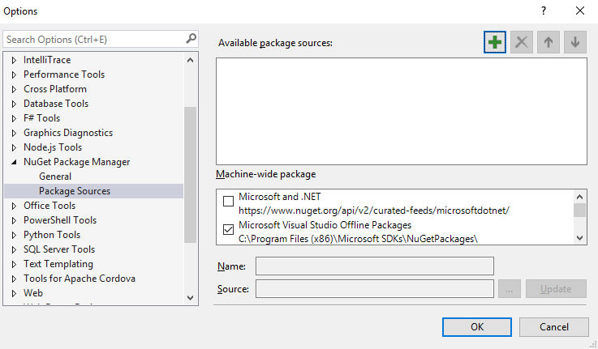
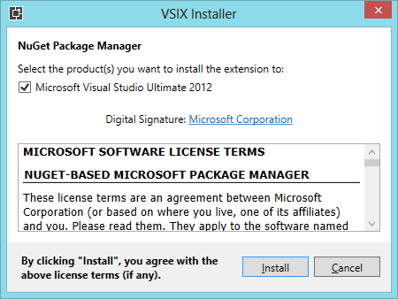
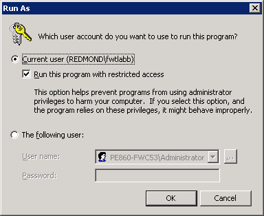

--- 
# required metadata 
 
title: "Known Issues with NuGet | Microsoft Docs" 
author: harikm 
ms.author: harikm 
manager: ghogen 
ms.date: 11/11/2016 
ms.topic: article 
ms.prod: nuget 
#ms.service: 
ms.technology: nuget 
ms.assetid: 42e7a619-1c69-454b-8243-16e2f9f950d0
 
# optional metadata 
 
#description: release notes Known Issues
#keywords: release notes Known Issues
#ROBOTS: 
#audience: 
#ms.devlang: 
ms.reviewer:  
- karann 
- harikm 
#ms.suite:  
#ms.tgt_pltfrm: 
#ms.custom: 
 
--- 
# Known Issues with NuGet

These are the most common known issues with NuGet that are repeatedly reported. If you are having trouble installing NuGet or managing packages, please take a look through these known issues and their resolutions.

## Authentication issues with NuGet feeds in VSTS with nuget.exe v3.4.3

**Problem:**

When we use the following command to store the credentials, we end up double encrypting the Personal Access Token.

$PAT = "Your personal access token"
$Feed = "Your url"
.\nuget.exe sources add -Name Test -Source $Feed -UserName $UserName -Password $PAT

**Workaround:**

Store passwords in clear text using the [-StorePasswordInClearText](../tools/nuget.exe-cli-reference.md#sources) option.

## Error installing packages with NuGet 3.4, 3.4.1

**Problem:**

In NuGet 3.4 and 3.4.1, when using the NuGet add-in, no sources are reported as available and you are unable to add new sources in the configuration window. The result is similar to the image below:

The NuGet.config file in your `%AppData%\NuGet\` folder has accidentally been emptied. To fix this: Close Visual Studio 2015, delete the NuGet.config file in the `%AppData%\NuGet\` folder and restart Visual Studio.  A new NuGet.Config file will be generated and you will be able to proceed.

## Error installing packages with NuGet 2.7

**Problem:**

In NuGet 2.7 or above, when you attempt to install any package which contains assembly references, you may receive the error message **"Input string was not in a correct format."**, like below: 

	PM> install-package log4net 
	 Installing 'log4net 2.0.0'. 
	 Successfully installed 'log4net 2.0.0'. 
	 Adding 'log4net 2.0.0' to Tyson.OperatorUpload. 
	 Install failed. Rolling back... 
	 install-package : Input string was not in a correct format. 
	 At line:1 char:1
	◾install-package log4net
	◾ ~~~~~~~~~~~~~~~~~~~~~~~
	◾CategoryInfo : NotSpecified: (:) [Install-Package], FormatException
	◾ FullyQualifiedErrorId : NuGetCmdletUnhandledException,NuGet.PowerShell.Commands.InstallPackageCommand

This is caused by the type library for the VSLangProj.dll COM component being unregistered on your system. This can happen, for example, when you have two versions of Visual Studio installed side-by-side and you then uninstall the older version. Doing so may inadvertently unregister the above COM library.

**Solution:**:

Run this command from an **elevated prompt** to re-register the type library for VSLangProj.dll

    regsvr32 "C:\Program Files (x86)\Common Files\microsoft shared\MSEnv\VsLangproj.olb"

If the command fails, check to see if the file exists in that location.

For more information about this error, see this [work item](https://nuget.codeplex.com/workitem/3609 "Work item 3609").

## Package Restore Consent Errors with NuGet 2.7

If you are using NuGet 2.7+, but you are working in a solution that had enabled package restore through the MSBuild-integrated approach, it's possible that package restore will still fail due to a lack of package restore consent. This happens when the version of `NuGet.exe` in your solution's `.nuget` folder is version 2.6 or earlier, where package restore consent was still OFF by default.

If you have upgraded to NuGet 2.7+ but your solution fails to build stating that you haven't given consent, you have a few options for proceeding:

1. **Force save your NuGet settings with consent given.** To do this, open Visual Studio's options and under Package Manager, choose General. Uncheck and then re-check the boxes for consent and click OK. This forces your `%AppData%\NuGet\NuGet.config` file to be saved with consent explicitly given, allowing NuGet 2.6 and earlier to see that you've given consent.
1. **Update the version of `NuGet.exe` in your `.nuget` folder.** To do this, run `nuget.exe update -self` from your `.nuget` folder, which will download the latest version of `NuGet.exe` and replace the version in the `.nuget` folder. The latest version of `NuGet.exe` will infer consent to be ON even when not explicitly saved in the `NuGet.config` file.
1. **Migrate to Automatic Package Restore.** For this approach, you would migrate from the MSBuild-integrated package restore to the Automatic Package Restore approach, following the [documented walkthrough](../consume-packages/package-restore.md#migrating-to-automatic-restore).

## Build failure after package update in VS 2012
The problem: You are using VS 2012 RTM. When updating NuGet packages, you get this message: 
"One or more packages could not be completed uninstalled." and you are prompted to restart 
Visual Studio. After VS restart, you get weird build errors.

The cause is that certain files in the old packages are locked by a background MSBuild process.
Even after VS restart, the background MSBuild process still uses the files in the old packages, 
causing the build failures.

The fix is to install VS 2012 Update, e.g. [VS 2012 Update 2](http://www.microsoft.com/en-us/download/details.aspx?id=38188).

## Upgrading to latest NuGet from an older version causes a signature verification error

If you are running VS 2010 SP1, you might run into the following error message when attempting to upgrade 
NuGet if you have an older version installed.

When viewing the logs, you might see a mention of a `SignatureMismatchException`.

To prevent this from occurring, there is a [Visual Studio 2010 SP1 hotfix](http://bit.ly/vsixcertfix) you can install.
Alternatively, the workaround is to simply uninstall NuGet (while running Visual Studio as Administrator) and then install it from the VS Extension Gallery.  See [http://support.microsoft.com/kb/2581019](http://support.microsoft.com/kb/2581019) for more information.

## Package Manager Console throws an exception when the Reflector Visual Studio Add-In is also installed.

When running the Package Manager console, you may run into the following exception message 
if you have the Reflector VS Add-in installed.

    The following error occurred while loading the extended type data file: 
    Microsoft.PowerShell.Core, C:\Windows\SysWOW64\WindowsPowerShell\v1.0\types.ps1xml(2950) : 
    Error in type "System.Security.AccessControl.ObjectSecurity": 
    Exception: Cannot convert the "Microsoft.PowerShell.Commands.SecurityDescriptorCommandsBase" 
    value of type "System.String" to type "System.Type".
    System.Management.Automation.ActionPreferenceStopException: 
    Command execution stopped because the preference variable "ErrorActionPreference" or common parameter 
    is set to Stop: Unable to find type

or

    System.Management.Automation.CmdletInvocationException: Could not load file or assembly 'Scripts\nuget.psm1' or one of its dependencies.  The parameter is incorrect. (Exception from HRESULT: 0x80070057 (E_INVALIDARG)) ---&gt; System.IO.FileLoadException: Could not load file or  assembly 'Scripts\nuget.psm1' or one of its dependencies. The parameter is incorrect. (Exception from HRESULT: 0x80070057 (E_INVALIDARG))  ---&gt; System.ArgumentException: Illegal characters in path.
       at System.IO.Path.CheckInvalidPathChars(String path)
       at System.IO.Path.Combine(String path1, String path2)
       at Microsoft.VisualStudio.Platform.VsAppDomainManager.&lt;AssemblyPaths&gt;d__1.MoveNext()
       at Microsoft.VisualStudio.Platform.VsAppDomainManager.InnerResolveHandler(String name)
       at Microsoft.VisualStudio.Platform.VsAppDomainManager.ResolveHandler(Object sender, ResolveEventArgs args)
       at System.AppDomain.OnAssemblyResolveEvent(RuntimeAssembly assembly, String assemblyFullName)
       --- End of inner exception stack trace ---
       at Microsoft.PowerShell.Commands.ModuleCmdletBase.LoadBinaryModule(Boolean trySnapInName, String moduleName, String fileName,  Assembly assemblyToLoad, String moduleBase, SessionState ss, String prefix, Boolean loadTypes, Boolean loadFormats, Boolean&amp; found)
       at Microsoft.PowerShell.Commands.ModuleCmdletBase.LoadModuleNamedInManifest(String moduleName, String moduleBase,  Boolean searchModulePath,  String prefix, SessionState ss, Boolean loadTypesFiles, Boolean loadFormatFiles, Boolean&amp; found)
       at Microsoft.PowerShell.Commands.ModuleCmdletBase.LoadModuleManifest(ExternalScriptInfo scriptInfo, ManifestProcessingFlags  manifestProcessingFlags, Version version)
       at Microsoft.PowerShell.Commands.ModuleCmdletBase.LoadModule(String fileName, String moduleBase, String prefix, SessionState ss,  Boolean&amp; found)
       at Microsoft.PowerShell.Commands.ImportModuleCommand.ProcessRecord()
       at System.Management.Automation.Cmdlet.DoProcessRecord()
       at System.Management.Automation.CommandProcessor.ProcessRecord()
       --- End of inner exception stack trace ---
       at System.Management.Automation.Runspaces.PipelineBase.Invoke(IEnumerable input)
       at System.Management.Automation.Runspaces.Pipeline.Invoke()
       at NuGetConsole.Host.PowerShell.Implementation.PowerShellHost.Invoke(String command, Object input, Boolean outputResults)
       at NuGetConsole.Host.PowerShell.Implementation.PowerShellHostExtensions.ImportModule(PowerShellHost host, String modulePath)
       at NuGetConsole.Host.PowerShell.Implementation.PowerShellHost.LoadStartupScripts()
       at NuGetConsole.Host.PowerShell.Implementation.PowerShellHost.Initialize()
       at NuGetConsole.Implementation.Console.ConsoleDispatcher.Start()
       at NuGetConsole.Implementation.PowerConsoleToolWindow.MoveFocus(FrameworkElement consolePane)

We've contacted the author of the add-in in the hopes of working out a resolution.

Update: We have verified that the latest version of Reflector, 6.5, no longer causes this exception in the console.

## Opening Package Manager Console fails with ObjectSecurity exception

You might see these errors when trying to open the Package Manager Console:

    The following error occurred while loading the extended type data file: Microsoft.PowerShell.Core, C:\Windows\SysWOW64\WindowsPowerShell\v1.0\types.ps1xml(2977) : Error in type "System.Security.AccessControl.ObjectSecurity": Exception: The getter method should be public, non void, static, and have one parameter of type PSObject. 
    The following error occurred while loading the extended type data file: Microsoft.PowerShell.Core, C:\Windows\SysWOW64\WindowsPowerShell\v1.0\types.ps1xml(2984) : Error in type "System.Security.AccessControl.ObjectSecurity": Exception: The getter method should be public, non void, static, and have one parameter of type PSObject. 
    The following error occurred while loading the extended type data file: Microsoft.PowerShell.Core, C:\Windows\SysWOW64\WindowsPowerShell\v1.0\types.ps1xml(2991) : Error in type "System.Security.AccessControl.ObjectSecurity": Exception: The getter method should be public, non void, static, and have one parameter of type PSObject. 
    The following error occurred while loading the extended type data file: Microsoft.PowerShell.Core, C:\Windows\SysWOW64\WindowsPowerShell\v1.0\types.ps1xml(2998) : Error in type "System.Security.AccessControl.ObjectSecurity": Exception: The getter method should be public, non void, static, and have one parameter of type PSObject. 
    The following error occurred while loading the extended type data file: Microsoft.PowerShell.Core, C:\Windows\SysWOW64\WindowsPowerShell\v1.0\types.ps1xml(3005) : Error in type "System.Security.AccessControl.ObjectSecurity": Exception: The getter method should be public, non void, static, and have one parameter of type PSObject. 
    The term 'Get-ExecutionPolicy' is not recognized as the name of a cmdlet, function, script file, or operable program. Check the spelling of the name, or if a path was included, verify that the path is correct and try again.

If so, follow the solution [discussed on StackOverflow](http://stackoverflow.com/questions/12638289/embedding-powershell-v2-0-in-net-app-on-windows-8-rtm) to fix them.

## The Add Package Library Reference dialog throws an exception if the solution contains InstallShield Limited Edition Project.

We have identified that if your solution contains one or more InstallShield Limited Edition project, the **Add Package Library 
Reference** dialog will throw an exception when opened. There is currently no workaround yet except either removing 
InstallShield projects or unloading them.

## Uninstall Button Greyed out? NuGet Requires Admin Privileges to Install/Uninstall

If you try to uninstall NuGet via the Visual Studio Extension Manager, you may notice that the Uninstall button is disabled. 
NuGet requires admin access to install and uninstall. Relaunch Visual Studio as an administrator to uninstall the extension. 
NuGet does not require admin access to use it.

## The Package Manager Console crashes when I open it in Windows XP. What's wrong?

NuGet requires Powershell 2.0 runtime. Windows XP, by default, doesn't have Powershell 2.0. You can download the Powershell 2.0 runtime from [http://support.microsoft.com/kb/968929](http://support.microsoft.com/kb/968929). After you install it, restart Visual Studio and you should be able to open Package Manager Console.

## Visual Studio 2010 SP1 Beta crashes on exit if the Package Manager Console is open.

If you have installed Visual Studio 2010 SP1 Beta, you may notice that if you leave the Package Manager Console open 
and close Visual Studio, it will crash. This is a known issue of Visual Studio and will be fixed in SP1 RTM release. 
For now, just ignore the crash or uninstall SP1 Beta if you can.

## The element 'metadata' ... has invalid child element exception occurs

If you installed packages built with a pre-release version of NuGet, you might encounter an error message stating
"The element 'metadata' in namespace 'schemas.microsoft.com/packaging/2010/07/nuspec.xsd' has invalid child element" when 
running the RTM version of NuGet with that project. You'll need to uninstall and then re-install each package 
using the RTM version of NuGet.

## Attempting to install or uninstall results in the error "Cannot create a file when that file already exists.&rdquo;

For some reason, Visual Studio extensions can get in a weird state where you've uninstalled the VSIX extension, 
but some files were left behind. To work around this issue:

1. Exit Visual Studio 
2. Open the following folder (it might be on a different drive on your machine) 

    <pre>C:\Program Files (x86)\Microsoft Visual Studio 10.0\Common7\IDE\Extensions\Microsoft Corporation\NuGet Package Manager\&lt;version&gt;\</pre>

3. Delete all the files with the *.deleteme* extensions. 
4. Re-open Visual Studio 

After following these steps, you should be able to continue.

## In rare cases, compiling with Code Analysis turned on causes error.

You might get the following error if you installs FluentNHibernate with the Package Manager console and then compile your project 
with "Code Analysis" turned on.

    Error 3 CA0058 : The referenced assembly 
    'NHibernate, Version=3.0.0.2001, Culture=neutral, PublicKeyToken=aa95f207798dfdb4' 
    could not be found. This assembly is required for analysis and was referenced by: 
    C:\temp\Scratch\src\MyProject.UnitTests\bin\Debug\MyProject.UnitTests.dll. 
    MyProject.UnitTests

David Kean has an [excellent blog post](http://davesbox.com/archive/2008/06/14/reference-resolutions-changes-in-code-analysis-and-fxcop-part-2.aspx) that explains this issue.

By default, FluentNHibernate requires NHibernate 3.0.0.2001. However, by design NuGet will install NHibernate 3.0.0.4000 in your project and add the appropriate binding redirects so that it will work. You project will compile just fine if code analysis is not turned on. In contrast to the compiler, code analysis tool doesn't properly follow the binding redirects to use 3.0.0.4000 instead of 3.0.0.2001. You can work around the issue by either installing NHibernate 3.0.0.2001 or tell the code analysis tool to behave the same as the compiler by doing the following:

1. Go to *%PROGRAMFILES%\Microsoft Visual Studio 10.0\Team Tools\Static Analysis Tools\FxCop* 
1. Open FxCopCmd.exe.config and change `AssemblyReferenceResolveMode` from `StrongName` to `StrongNameIgnoringVersion`. 
1. Save the change and rebuild your project. 

## Write-Error command doesn't work inside install.ps1/uninstall.ps1/init.ps1

This is a known issue. Instead of calling Write-Error, try calling throw.

    throw "My error message"

## Installing NuGet with restricted access on Windows 2003 can crash Visual Studio
When attempting to install NuGet using the Visual Studio Extension Manager and not running 
as an administrator, the &#8220;Run As&#8221; dialog is displayed with the checkbox labeled 
&#8220;Run this program with restricted access&#8221; checked by default.

Clicking OK with that checked crashes Visual Studio. Make sure to uncheck that option before 
installing NuGet.

## Cannot uninstall NuGet for Windows Phone Tools
Windows Phone Tools does not have support for the Visual Studio Extension Manager. In order to 
uninstall NuGet, run the following command.

     vsixinstaller.exe /uninstall:NuPackToolsVsix.Microsoft.67e54e40-0ae3-42c5-a949-fddf5739e7a5

## Changing the capitalization of NuGet package IDs breaks package restore
As discussed at length on [this GitHub issue](https://github.com/Particular/NServiceBus/issues/1271#issuecomment-20865932),
changing the capitalization of NuGet packages can be done by NuGet support, but causes
complications during package restore for users who have existing, differently-cased, packages
in their local package cache. We recommend only requesting a case change when you have a way to
communicate with existing users of your package about the break that may occur to their
build-time package restore.

## Reporting Issues
For reporting issues on NuGet Clients, please go [here](https://nuget.codeplex.com/WorkItem/Create).
For reporting issues on NuGet Gallery, please go [here](https://github.com/nuget/nugetgallery/issues).
