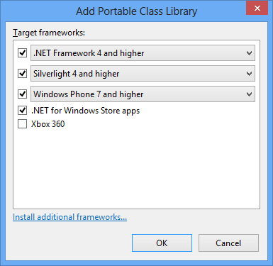
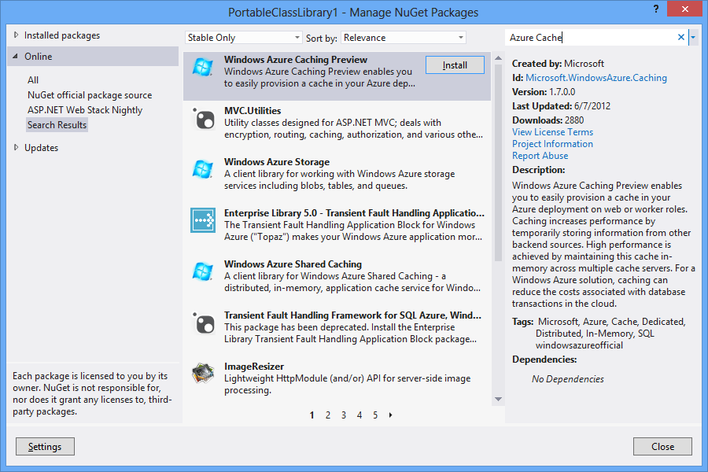
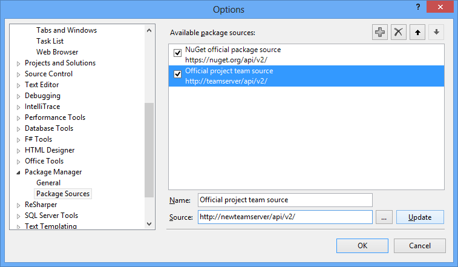

# NuGet 2.1 Release Notes

[NuGet 2.0 Release Notes](../release-notes/nuget-2.0.md) | [NuGet 2.2 Release Notes](../release-notes/nuget-2.2.md)

NuGet 2.1 was released on October 4, 2012.

## Hierarchical Nuget.Config
NuGet 2.1 gives you greater flexibility in controlling NuGet settings by way of recursively walking up the folder structure looking for `NuGet.Config` files and then building the configuration from the set of all found files.  As an example, consider the scenario where a team has an internal package repository for CI builds of other internal dependencies. The folder structure for an individual project might look like the following:

    C:\
    C:\myteam\
    C:\myteam\solution1
    C:\myteam\solution1\project1

Additionally, if package restore is enabled for the solution, the following folder will also exist:

    C:\myteam\solution1\.nuget

In order to have the team’s internal package repository available for all projects that the team works on, while not making it available for every project on the machine, we can create a new Nuget.Config file and place it in the c:\myteam folder. There is no way to specificy a packages folder per project.

```xml
<configuration>
    <packageSources>
    <add key="Official project team source" value="http://teamserver/api/v2/" />
    </packageSources>
    <disabledPackageSources />
    <activePackageSource>
    <add key="Official project team source" value="http://teamserver/api/v2/" />
    </activePackageSource>
</configuration>
```

We can now see that the source was added by running the ‘nuget.exe sources’ command from any folder beneath c:\myteam as shown below:


`NuGet.Config` files are searched for in the following order:

1. `.nuget\Nuget.Config`
2. Recursive walk from project folder to root
3. Global `Nuget.Config` (`%appdata%\NuGet\Nuget.Config`)

The configurations are than applied in the *reverse order*, meaning that based on the above ordering, the global Nuget.Config would be applied first, followed by the discovered Nuget.Config files from root to project folder, followed by `.nuget\Nuget.Config`.  This is particularly important if you’re using the `<clear/>` element to remove a set of items from config.

## Specify ‘packages’ Folder Location
In the past, NuGet has managed a solution’s packages from a known ‘packages’ folder found beneath the solution root folder.  For development teams that have many different solutions which have NuGet packages installed, this can result in the same package being installed in many different places on the file system.

NuGet 2.1 provides more granular control over the location of the packages folder via the `repositoryPath` element in the `NuGet.Config` file.  Building on the previous example of hierarchical Nuget.Config support, assume that we wish to have all projects under C:\myteam\ share the same packages folder.  To accomplish this, simply add the following entry to `c:\myteam\Nuget.Config`.

```xml
<configuration>
    <config>
    <add key="repositoryPath" value="C:\myteam\teampackages" />
    </config>
    ...
</configuration>
```

In this example, the shared `Nuget.Config` file specifies a shared packages folder for every project that is created beneath C:\myteam, regardless of depth. Note that if you have an existing packages folder underneath your solution root, you will need to delete it before NuGet will place packages in the new location.

## Support for Portable Libraries
[Portable libraries](/dotnet/standard/cross-platform/cross-platform-development-with-the-portable-class-library) is a feature first introduced with .NET 4 that enables you to build assemblies that can work without modification on different Microsoft platforms, from versions of the.NET Framework to Silverlight to Windows Phone and even Xbox 360 (though at this time, NuGet does not support the Xbox portable library target).  By extending the [package conventions](../create-packages/supporting-multiple-target-frameworks.md) for framework versions and profiles, NuGet 2.1 now supports portable libraries by enabling you to create packages that have compound framework and profile target `lib` folders.

As an example, consider the following portable class library’s available target platforms.



After the library is built and the command `nuget.exe pack MyPortableProject.csproj` is run, the new portable library package folder structure can be seen by examining the contents of the generated NuGet package.


As you can see, the portable library folder name convention follows the pattern ‘portable-{framework 1}+{framework n}’ where the framework identifiers follow the existing [framework name and version conventions](../schema/target-frameworks.md). One exception to the name and version conventions is found in the framework identifier used for Windows Phone.  This moniker should use the framework name ‘wp’ (wp7, wp71 or wp8). Using ‘silverlight-wp7’, for example, will result in an error.

When installing the package that is created from this folder structure, NuGet can now apply its framework and profile rules to multiple targets, as specified in the folder name.  Behind NuGet’s matching rules is the principle that “more specific” targets will take precedence over “less specific” ones.  This means that monikers targeting a specific platform will always be preferred over portable ones if they are both compatible with a project.  Additionally, if multiple portable targets are compatible with a project, NuGet will prefer the one where the set of platforms supported is “closest” to the project referencing the package.

## Targeting Windows 8 and Windows Phone 8 Projects
In addition to adding support for targeting portable library projects, NuGet 2.1 provides new framework monikers for both Windows 8 Store and Windows Phone 8 projects, as well as some new general monikers for Windows Store and Windows Phone projects that will be easier to manage across future versions of the respective platforms.

For Windows 8 Store applications, the identifiers look as follows:

|NuGet 2.0 and earlier|NuGet 2.1|
|----------------|-----------|
|winRT45, .NETCore45|Windows, Windows8, win, win8|

<br/>
For Windows Phone projects, the identifiers look as follows:

|Phone OS|NuGet 2.0 and earlier|NuGet 2.1
|----------------|-----------|-----------|
|Windows Phone 7|silverlight3-wp|wp, wp7, WindowsPhone, WindowsPhone7|
|Windows Phone 7.5 (Mango)|silverilght4-wp71|wp71, WindowsPhone71|
|Windows Phone 8|(not supported)|wp8, WindowsPhone8|
<br/>
In all of the above changes, the old framework names will continue to be fully supported by NuGet 2.1.  Moving forward, the new names should be used as they will be more stable across future versions of the respective platforms. The new names will *not* be supported in versions of NuGet prior to 2.1, however, so plan accordingly for when to make the switch.

## Improved Search in Package Manager Dialog
Over the past several iterations, changes have been introduced to the NuGet gallery that greatly improved the speed and relevance of package searches.  However, these improvements were limited to the nuget.org Web site.  NuGet 2.1 makes the improved search experience available through the NuGet package manager dialog.  As an example, imagine that you wanted to find the Windows Azure Caching Preview package.  A reasonable search query for this package may be “Azure Cache”.  In previous versions of the package manager dialog, the desired package would not even be listed on the first page of results.  However, in NuGet 2.1, the desired package now shows up at the top of the search results.



## Force Package Update
Prior to NuGet 2.1, NuGet would skip updating a package when there was a not a high version number.  This introduced friction for certain scenarios – particularly in the case of build or CI scenarios where the team did not want to increment the package version number with each build.  The desired behavior was to force an update regardless.  NuGet 2.1 addresses this with the ‘reinstall’ flag.  For example, previous versions of NuGet would result in the following when attempting to update a package that did not have a more recent package version:

    PM> Update-Package Moq
    No updates available for 'Moq' in project 'MySolution.MyConsole'.

With the reinstall flag, the package will be updated regardless of whether there is a newer version.

    PM> Update-Package Moq -Reinstall
    Successfully removed 'Moq 4.0.10827' from MySolution.MyConsole.
    Successfully uninstalled 'Moq 4.0.10827'.
    Successfully installed 'Moq 4.0.10827'.
    Successfully added 'Moq 4.0.10827' to MySolution.MyConsole.

Another scenario where the reinstall flag proves beneficial is that of framework re-targeting. When changing the target framework of a project (for example, from .NET 4 to .NET 4.5), Update-Package -Reinstall can update references to the correct assemblies for all NuGet packages installed in the project.

## Edit Package Sources Within Visual Studio
In previous versions of NuGet, updating a package source from within the Visual Studio options dialog required deleting and re-adding the package source.  NuGet 2.1 improves this workflow by supporting update as a first class function of the configuration user interface.



## Bug Fixes
NuGet 2.1 includes many bug fixes. For a full list of work items fixed in NuGet 2.0, please view the [NuGet Issue Tracker for this release](http://nuget.codeplex.com/workitem/list/advanced?keyword=&status=Fixed&type=All&priority=All&release=NuGet%202.1&assignedTo=All&component=All&sortField=LastUpdatedDate&sortDirection=Descending&page=0).
