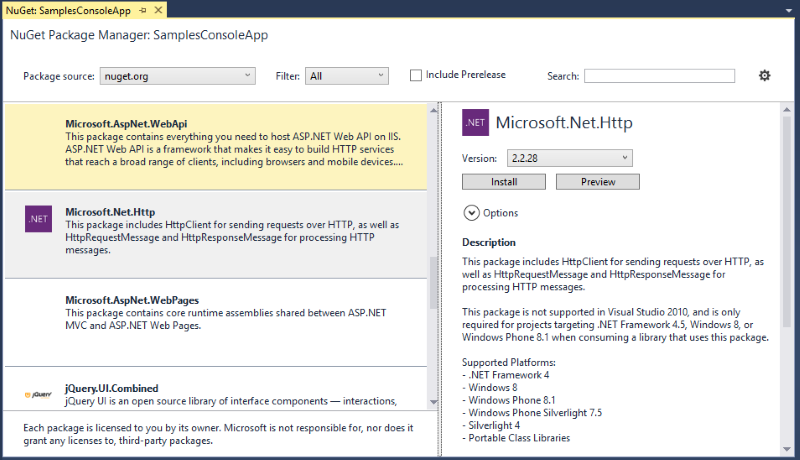
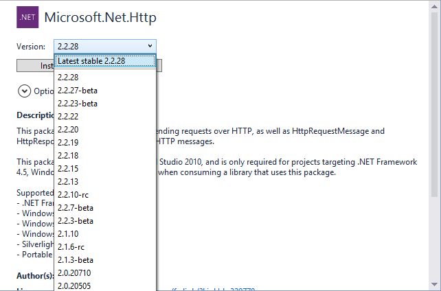
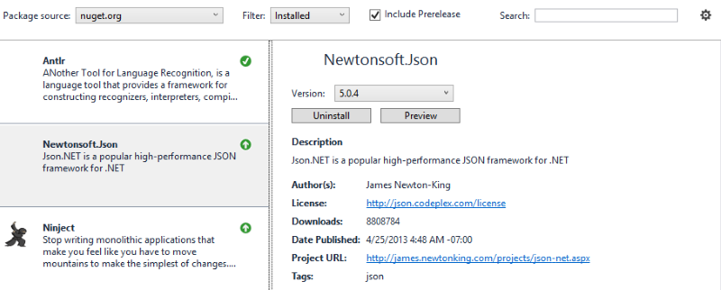
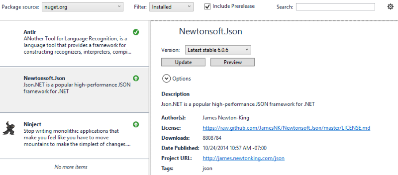
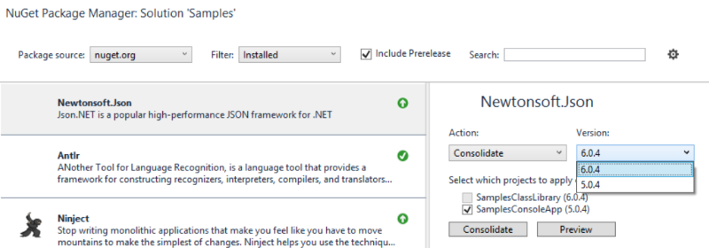
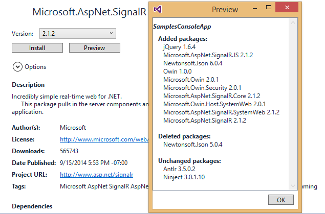
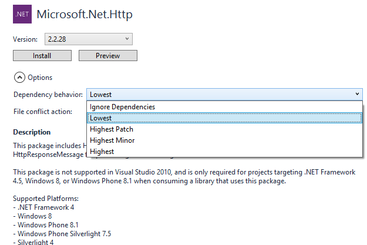
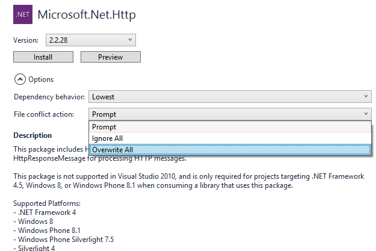
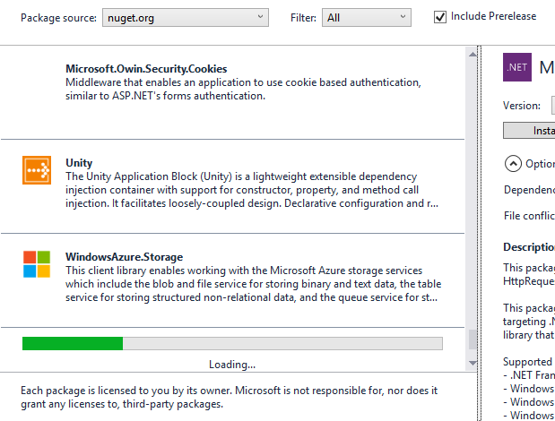

--- 
# required metadata 
 
title: ["NuGet 3.0 Preview Release Notes | Microsoft Docs"] 
author: harikmenon
ms.author: harikm 
manager: ghogen 
ms.date: 11/11/2016 
ms.topic: article 
ms.prod: nuget 
#ms.service: 
ms.technology: nuget 
ms.assetid: [6762b6f8-82b7-4bab-a1f0-cd25e5dc1fb4] 
 
# optional metadata 
 
#description: release notes 3.0 preview
#keywords: release notes 3.0 preview
#ROBOTS: 
#audience: 
#ms.devlang: 
ms.reviewer:  
- karann 
- harikm 
#ms.suite:  
#ms.tgt_pltfrm: 
#ms.custom: 
 
---
# NuGet 3.0 Preview Release Notes

[NuGet 2.9 Release Notes](/nuget/release-notes/nuget-2.9) | [NuGet 3.0 Beta Release Notes](/nuget/release-notes/nuget-3.0-beta)

NuGet 3.0 Preview was released on November 12, 2014 as part of the Visual Studio 2015 Preview release. We released NuGet 3.0 Preview. This is a big release for us (albeit a preview), and we're excited to start getting feedback on our changes.

## Visual Studio 2012+

This NuGet 3.0 Preview is included in Visual Studio 2015 Preview. We are working to get preview drops out for Visual Studio 2012 and Visual Studio 2013 very soon. We previously shared our intent to [discontinue updates for Visual Studio 2010](http://blog.nuget.org/20141002/visual-studio-2010.html), and we did make that difficult decision.

## Brand New UI

The first thing you'll notice about NuGet 3.0 Preview is our brand new UI. It's no longer a modal dialog; it's now a full Visual Studio document window. This allows you to open the UI for multiple projects (and/or the solution) at once, tear the window off to another monitor, dock it however you'd like, etc.

Beyond the usability differences because of abandoning the modal dialog, we also have lots of new features in the new UI.

### Version Selection

Perhaps the most requested UI feature is to allow version selection for package installation and update--this is now available.

Whether you are installing or updating a package, the version dropdown allows you to see all of the versions available for the package, with some notable versions promoted to the top of the list for easy selection. You no longer need to use the PowerShell Console to get specific versions that are not the latest.

### Combined Installed/Online/Updates Workflows

Our previous UI had 3 tabs for Installed, Online, and Updates. The packages listed were specific to those workflows and the actions available were specific to the workflows as well. While that seemed logical, we heard that many of you would often get tripped up by this separation.

We now have a combined experience, where you can install, update, or uninstall a package regardless of how you got the package selected. To assist with the specific workflows, we now have a Filter dropdown that lets you filter the packages visible, but then the actions available for the package are consistent.

By using the "Installed" filter, you can then easily see your installed packages, which ones have updates available, and then you can either uninstall or update the package by changing the version selection to see change the action available.

### Version Consolidation

It's common to have the same package installed into multiple projects within your solution. Sometimes the versions installed into each project can drift apart and it is necessary to consolidate the versions in use. NuGet 3.0 Preview introduces a new feature for just this scenario.

The solution-level package management window can be accessed by right-clicking on the solution and choosing Manage NuGet Packages for Solution. From there, if you select a package that is installed into multiple projects, but with different versions in use, a new "Consolidate" action becomes available. In the screen shot below, `Newtonsoft.Json` was installed into the `SamplesClassLibrary` with version `6.0.4` and installed into `SamplesConsoleApp` with version `5.0.4`.

Here's the workflow for consolidating onto a single version.

1. Select the `Newtonsoft.Json` package in the list
1. Choose `Consolidate` from the `Action` dropdown
1. Use the `Version` dropdown to select the version to be consolidated onto
1. Check the boxes for the projects that should be consolidated onto that version (note that projects already on the selected version will be greyed out)
1. Click the `Consolidate` button to perform the consolidation

### Operation Previews

Regardless of which operation you're performing--install/update/uninstall--the new UI now offers a way to preview the changes that will be made to your project. This preview will show any new packages that will be installed, packages that will be updated, and packages that will be uninstalled, along with packages that will be unchanged during the operation.

In the example below, we can see that installing Microsoft.AspNet.SignalR will result in quite a few changes to the project.

### Installation Options

Using the PowerShell Console, you've had control over a couple of notable installation options. We've now brought those features into the UI as well. You can now control the dependency resolution behavior for how versions of the dependencies are selected.

You can also specify the action to take when content files from packages conflict with files already in your project.

### Infinite Scrolling

We used to get quite a bit of feedback on our UI having both the scrolling and paging paradigms when listing packages. It was pretty common to have to scroll to the bottom of the short list, click the next page number, and then scroll again. With the new UI, we've implemented infinite scrolling in the package list so that you only need to scroll--no more paging.

### Make it Work, Make it Fast, Make it Pretty

We are excited to get this new UI out for you to try out. During this Preview milestone, we've been following the good old adage of "Make it work, make it fast, make it pretty." In this preview, we've accomplished most of that first goal--it works. We know it's not quite fast yet, and we know it's not quite pretty yet. Trust that we'll be working on those goals between now and the RC release. In the meantime, we would love to hear your feedback about the *usability* of the new UI--the workflows, operations, and how it *feels* to use the new UI.

There are a couple of functions that we've removed when compared to the old UI. One of these was intentional, and the other one just didn't get done in time.

#### Searching "All" Package Sources

The old UI allowed you to perform a package search against all of your package sources. We've removed that feature in the UI and we won't be bringing it back. This feature used to perform search operations against all of your package sources, weave the results together, and attempt to order the results based on your sorting selection.

We found that search relevance is really hard to weave together. Could you imagine performing a search against Google and Bing and weaving the results together? Additionally, this feature was slow, easy to *accidentally* use, and we believe it was rarely actually useful. Because of the problems the feature introduced, we received a number of bug reports on it that could never have been fixed.

#### Update All

We used to have an "Update All" button in the old UI that isn't there in the new UI yet. We will resurrect this feature for our RC release.

## New Client/Server API

In addition to all of the new features in our new package management UI, we've also been working on some implementation details for NuGet's client/server protocol. The work we've done is to create "API v3" for NuGet, which is designed around high availability for critical scenarios such as package restore and installing packages. The new API is based on REST and Hypermedia and we've selected [JSON-LD](http://json-ld.org) as our resource format.

In the NuGet 3.0 Preview bits, you'll see a new package source called "preview.nuget.org" in the package source dropdown. If you select that package source, we'll use our new API rather to connect to nuget.org. We've made the preview source available in the UI while we continue to test, revise, and improve the new API. In NuGet 3.0 RC, this new API v3-based package source will replace the v2-based "nuget.org" package source.

Despite the investment we're putting into API v3, we've made all of these new features also work with our existing API v2 protocol, which means they will work with existing package sources other than nuget.org as well.

## New Features Coming

Between now and 3.0 RTM, we are also working on some fundamental new NuGet features, beyond what you'll see in the UI. Here's a short list of salient investment areas:

1. We're partnering with the Visual Studio and MSBuild teams to get [NuGet deeper into the platform](http://blog.nuget.org/20141014/in-the-platform.html).
1. We're working to abandon installation-time package conventions and instead apply those conventions at packaging time by introducing a new "authoritative" [package manifest](http://blog.nuget.org/20141023/package-manifests.html).
1. We're working to refactor the NuGet codebase to make the client and server components reusable in different domains beyond package management in Visual Studio.
1. We're investigating the notion of "private dependencies" where a package can indicate that it has dependencies on other packages for implementation details only, and those dependencies shouldn't be surfaced as top-level dependencies.

## Stay Tuned

Please keep an eye on [our blog](http://blog.nuget.org) for more progress and announcements for NuGet 3.0!
