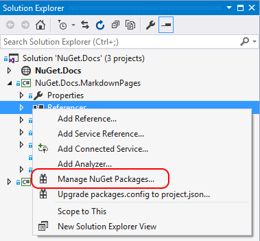
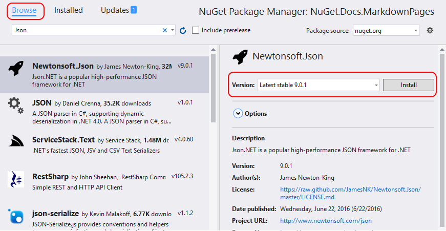
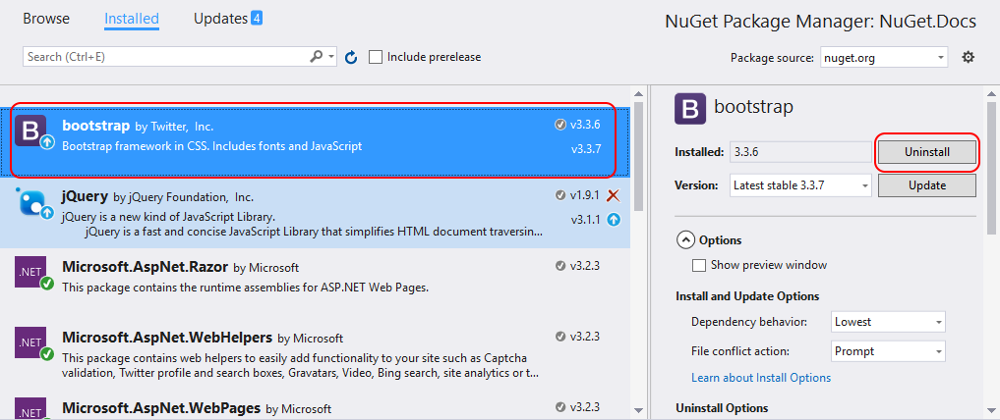
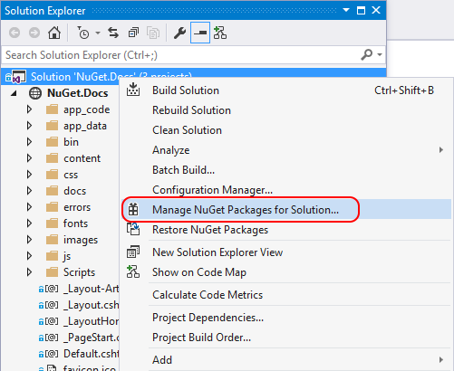
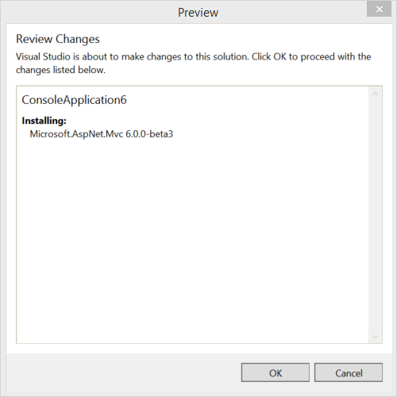

---
# required metadata

title: NuGet Package Manager UI Reference | Microsoft Docs
author: kraigb
ms.author: kraigb
manager: ghogen
ms.date: 07/24/2017
ms.topic: article
ms.prod: nuget
#ms.service:
ms.technology: null
ms.assetid: 62f6962b-7b84-4452-ae0d-a9e1ef1fc6f0
f1_keywords: 
  - "vs.toolsoptionspages.nuget_package_manager"
  - "vs.toolsoptionspages.nuget_package_manager.general"
  - "vs.toolsoptionspages.nuget_package_manager.package_sources"

# optional metadata

description: Instructions for using the NuGet Package Manager UI in Visual Studio for working with NuGet packages.
keywords: NuGet UI, NuGet package manager UI, NuGet in Visual Studio, managing NuGet packages, NuGet user interface, package manager in Visual Studio
#ROBOTS:
#audience:
#ms.devlang:
ms.reviewer:
- karann
- unnir
#ms.suite:
#ms.tgt_pltfrm:
#ms.custom:

---

# NuGet Package Manager UI

The NuGet Package Manager UI in Visual Studio on Windows allows you to easily install, uninstall, and update NuGet packages in projects and solutions. For the experience in Visual Studio for Mac, see [Including a NuGet package in your project](https://docs.microsoft.com/visualstudio/mac/nuget-walkthrough).

In this topic:

- [Finding and installing a package](#finding-and-installing-a-package)
- [Uninstalling a package](#uninstalling-a-package)
- [Updating a package](#updating-a-package) (includes the ["Implicitly referenced by an SDK" or "AutoReferenced" message](#implicit_reference))
- [Managing packages for the solution](#managing-packages-for-the-solution) (working with multiple projects at the same time).
- [Package sources](#package-sources)
- [Package manager Options control](#package-manager-options-control)

> [!Note]
> If you're missing the NuGet Package Manager in Visual Studio 2015, check **Tools > Extensions and Updates...** and search for the *NuGet Package Manager* extension. If you're unable to use the extensions installer in Visual Studio, you can download the extension directly from [https://dist.nuget.org/index.html](https://dist.nuget.org/index.html).
>
> In Visual Studio 2017, NuGet and the NuGet Package Manager are automatically installed when you select any .NET-related workloads; you can also install it individually by checking the **Individual components > Code tools > NuGet package manager** option in the Visual Studio 2017 installer.

## Finding and installing a package

1. In **Solution Explorer**, right-click either **References**  or a project and select **Manage NuGet Packages...**. (In web site projects, right-click the **Bin** folder instead.)

    

2. The **Browse** tab displays available packages by popularity. Search for a specific package using the search box on the top right. Select a package to display the package information on the right and to enable the **Install** button along with a version-selection drop-down.

    

3. Select the desired version from the drop-down and select **Install**. Visual Studio installs the package and its dependencies into the project. You may be asked to accept license terms in the process. When installation is complete, the added packages appear on the **Installed** tab. **Solution Explorer** also shows the added packages, which you can now use in your project.

    

## Uninstalling a package

1. In **Solution Explorer**, right-click either **References** or the desired project, and select **Manage NuGet Packages...**. (In web site projects, right-click the **Bin** folder instead.)
2. Select the **Installed** tab.
3. Select the package to uninstall and select **Uninstall**.

    

## Updating a package

1. In **Solution Explorer**, right-click either **References** or the desired project, and select **Manage NuGet Packages...**. (In web site projects, right-click the **Bin** folder instead.)
2. Select the **Updates** tab to see packages that have available updates.
3. Select the package to update, select the desired version from the drop-down on the right, and select **Update**.

    

4. For some packages, the **Update** button is disabled and the package a message appears saying that it's "Implicitly referenced by an SDK". (In some versions of Visual Studio the text may read only "AutoReferenced".) These conditions indicate that the package, such as Microsoft.NETCore.App, is part of a larger framework or SDK and should not be updated independently. (Such packages, of which Microsoft.NETStandard.Library is another example, are marked internally with `<IsImplicitlyDefined>True</IsImplicitlyDefined>`.) To update the package, you must update the SDK to which it belongs.

    

## Managing packages for the solution
*NuGet 1.4+*

1. Select the **Tools > NuGet Package Manager > Manage NuGet Packages for Solution...** menu command, or right-click the solution and select **Manage NuGet Packages...**:

    

2. When managing packages for the solution, the UI lets you select the projects that are affected by the operations:

    

## Package sources

To change the source Visual Studio uses to obtain packages, select one from the source selector:

To manage package sources:

1. Select the **Settings** icon in the Package Manager UI outlined below or use the **Tools > Options** command and scroll to **NuGet Package Manager**:

    

2. Select the **Package Sources** node:

    

3. To add a source, select **+**, edit the name, enter the URL or path in the **Source** control, and select  **Update**. The source now appears in the selector drop-down.
4. To change a package source, select it, make edits in the **Name** and **Source** boxes, and select **Update**.
5. To disable a package source, clear the box to the left of the name in the list.
6. To remove a package source, select it and then select the **X** button.
7. Use the up and down arrow buttons to change the priority order of the package sources. Visual Studio searches these sources in the priority order when restoring packages for a project. For more information, see [Package restore](../Consume-Packages/Package-Restore.md).

> [!Tip]
> If a package source reappears after deleting it, it may be listed in a computer-wide or global NuGet.Config files. See [Configuring NuGet behavior](../Consume-Packages/Configuring-NuGet-Behavior.md) for the location of these files, then edit those files manually to remove the source. Sources can also be managed through the [`nuget sources` command](../tools/nuget-exe-CLI-reference.md).

## Package manager Options control

In the Package Manager UI there is a small, expandable **Options** control (shown here both collapsed and expanded):

The following sections explain these options.

### Show preview window

When selected, a modal window displays which the dependencies of a chosen package.

<!-- This is here because the link in the UI needs this anchor. See https://github.com/NuGet/NuGet.Client/blob/dev/src/NuGet.Clients/PackageManagement.UI/Xamls/OptionsControl.xaml -->

### Install and Update Options

**Dependency behavior** configures how NuGet decides which versions of dependent packages to install:

- *Ignore dependencies* skips installing any dependencies, which typically breaks the package being installed.
- *Lowest* [Default] installs the dependency with the minimal version number that meets the requirements of the primary chosen package.
- *Highest Patch* installs the version with the same major and minor version numbers, but the highest patch number. For example, if version 1.2.2 is specified then the highest version that starts with 1.2 will be installed
- *Highest Minor* installs the version with the same major version number but the highest minor number and patch number. If version 1.2.2 is specified, then the highest version that starts with 1 will be installed
- *Highest* installs the highest available version of the package.

**File conflict action** specifies how NuGet should handle packages that already exist in the project or local machine:

- *Prompt* instructs NuGet to ask whether to keep or overwrite existing packages.
- *Ignore All* instructs NuGet to skip overwriting any existing packages.
- *Overwrite All* instructs NuGet to overwrite any existing packages.

<!-- This is here because the link in the UI needs this anchor. See https://github.com/NuGet/NuGet.Client/blob/dev/src/NuGet.Clients/PackageManagement.UI/Xamls/OptionsControl.xaml -->

### Uninstall Options

**Remove dependencies**: when selected, removes any dependent packages if they are not referenced elsewhere in the project.

**Force uninstall even if there are dependencies on it**: when selected, uninstalls a package even if it's still being referenced in the project. This is typically used in combination with **Remove dependencies** to remove a package and whatever dependencies it installed. Using this option may, however, lead to a broken references in the project. In such cases you may need to [reinstall those other packages](../consume-packages/reinstalling-and-updating-packages.md).
