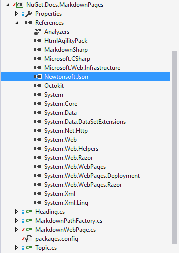
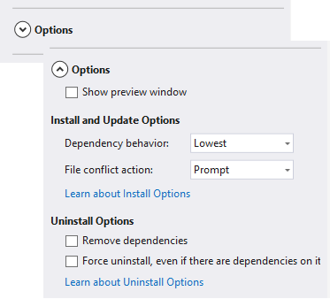

--- 
# required metadata 
 
title: NuGet Package Manager UI | Microsoft Docs
author: kraigb 
ms.author: kraigb 
manager: ghogen 
ms.date: 1/5/2017 
ms.topic: article 
ms.prod: nuget 
#ms.service: 
ms.technology: nuget 
ms.assetid: 62f6962b-7b84-4452-ae0d-a9e1ef1fc6f0
 
# optional metadata 
 
#description: 
#keywords: 
#ROBOTS: 
#audience: 
#ms.devlang: 
ms.reviewer:  
- karann 
- harikm 
#ms.suite:  
#ms.tgt_pltfrm: 
#ms.custom: 
 
--- 

# NuGet Package Manager UI

The NuGet Package Manager UI in Visual Studio allows you to easily install, uninstall, and update NuGet packages in projects and solutions.

In this topic:

- [Finding and installing a package](#finding-and-installing-a-package)
- [Uninstalling a package](#uninstalling-a-package)
- [Updating a package](#updating-a-package)
- [Managing packages for the solution](#managing-packages-for-the-solution) (working with multiple projects at the same time).
- [Package sources](#package-sources)
- [Package manager Options control](#package-manager-options-control)

## Finding and installing a package

1. In **Solution Explorer**, right-click **References** (or **Bin** in a Website project), or the desired project, and select **Manage NuGet Packages...**.

	

2. On the **Browse** tab, browse the list or search for a specific package using the search box on the top right. Selecting a package displays the package information on the right and enables the **Install** button along with a version-selection drop-down.

	

3. Select the desired version from the drop-down and click **Install**. This installs the package and its dependencies; you may be asked to accept license terms in the process. When installation is complete, the new packages appear on the **Installed** tab. **Solution Explorer** also shows the added packages, which you can now use in your project.  

	

## Uninstalling a package

1. In **Solution Explorer**, right-click **References** (or **Bin** in a Website project), or the desired project, and select **Manage NuGet Packages...**.
2. Click on the **Installed** tab.
3. Select the package to uninstall and click **Uninstall**.

	

## Updating a package

1. In **Solution Explorer**, right-click **References** (or **Bin** in a Website project), or the desired project, and select **Manage NuGet Packages...**.
2. Click on the **Updates** tab to see packages that have available updates.
3. Select the package to update, select the desired version from the drop-down on the right, and click **Update**.

	

## Managing packages for the solution
*NuGet 1.4+*

1. Select the **Tools > NuGet Package Manager > Manage NuGet Packages for Solution...** menu command, or right-click the solution and select **Manage NuGet Packages...**: 

	

2. When managing packages for the solution, the UI lets you select which projects will be affected:

	

## Package Sources

The NuGet Package Manager UI allows you to easily switch between package sources using the package source selector:

To manage package sources:

1. Click on the **Settings** icon in the Package Manager UI outlined below or use the **Tools > Options** command. and scroll to **NuGet Package Manager**.

	

2. Select the **Package Sources** node: 
 
	

3. To add a source, click the **+** button, edit the name, enter the URL or path in the **Source** control, and click **Update**. This will make it appear in the selector drop-down.
4. To change a package source, select it, make edits in the **Name** and **Source** boxes, and click **Update**.
5. To disable a package source, uncheck the box to the left of the name in the list.
6. To remove a package source, select it and click the **X** button.
7. Use the up and down arrow buttons to change the priority order of the package sources.

## Package manager Options control

In the Package Manager UI there is a small, expandable **Options** control (shown here both collapsed and expanded):

The following sections explain these options.

### Show preview window

When checked, a modal window displays which dependent packages will be loaded with the package you have chosen.

### Install and Update Options
<!-- This is here because the link in the UI needs this anchor. See https://github.com/NuGet/NuGet.Client/blob/dev/src/NuGet.Clients/PackageManagement.UI/Xamls/OptionsControl.xaml -->

**Dependency behavior** configures how NuGet decide which versions of dependent packages to installed:

- *Ignore dependencies* skips installing any dependencies, which typically breaks the package being installed.
- *Lowest* installs the dependency with the minimal version number that meets the requirements of the primary chosen package.
- *Highest Patch* installs the version with the same major and minor version numbers, but the highest patch number. For example, if version 1.2.2 is specified then the highest version that starts with 1.2 will be installed
- *Highest Minor* installs the version with the same major version number but the highest minor number and patch number. If version 1.2.2 is specified, then the highest version that starts with 1 will be installed
- *Highest* installs the highest available version of the package.

**File conflict action** specifies how NuGet should handle packages that already exist in the project or local machine:

- *Prompt* instructs NuGet to ask whether to keep or overwrite existing packages.
- *Ignore All* instructs NuGet to skip overwriting any existing packages.
- *Overwrite All* instructs NuGet to overwrite any existing packages. 

### Uninstall Options
<!-- This is here because the link in the UI needs this anchor. See https://github.com/NuGet/NuGet.Client/blob/dev/src/NuGet.Clients/PackageManagement.UI/Xamls/OptionsControl.xaml -->

**Remove dependencies**: when checked, removes any dependent packages if they are not referenced elsewhere in the project.

**Force uninstall even if there are dependencies on it**: when checked, uninstalls a package even if it's still being referenced in the project. This is typically used in combination with **Remove dependencies** to remove a package and whatever dependencies it installed. Using this option may, however, lead to a broken references in the project, in which case you may need to [reinstall those other packages](../consume-packages/reinstalling-and-updating-packages.md).
