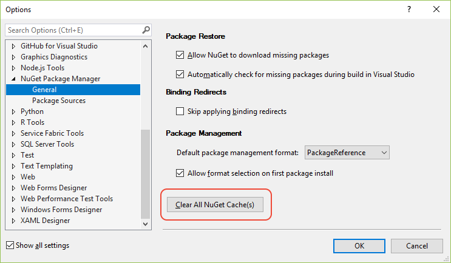

# Managing the global packages, the cache, and temp folders

Whenever you install, update, or restore a package, NuGet manages packages and package information in several folders outside of your project structure:

| Name | Location (per user) | Description |
| --- | --- | --- |
| global-packages | `%userprofile%\.nuget\packages` (Windows)<br/>`~/..nuget/packages` (Mac/Linux)<br/>Override using the NUGET_PACKAGES environment variable. | The *global-packages* folder is where NuGet installs any downloaded package. Each package is fully expanded into a subfolder that matches the package identifier and version number. Projects using the PackageReference format always use packages directly from this folder. When using the `packages.config`, packages are installed to the *global-packages* folder, then copied into the project's `packages` folder. |
| http-cache | `%localappdata%\NuGet\v3-cache` (Windows)<br/>`~/.local/share/NuGet/v3-cache` (Mac/Linux)<br/>Override using the NUGET_HTTP_CACHE_PATH environment variable. | The Visual Studio Package Manager (NuGet 3.x+) and the `dotnet` tool store copies of downloaded packages in this cache (saved as `.dat` files), organized into subfolders for each package source. Packages are not expanded, and the cache is not used by the `nuget.exe` tool. |
| temp | `%TEMP%\NuGetScratch` (Windows)<br/>`/tmp/NuGetScratch` (Mac/Linux) | A folder where NuGet stores temporary files during its various operations. |

> [!Note]
> NuGet 3.5 and earlier uses *packages-cache* instead of the *http-cache*, which is located in `%localappdata%\NuGet\Cache`.

By using the cache and *global-packages* folders, NuGet generally avoids downloading packages that already exist on the computer, including the performance of install, update, and restore operations. When using PackageReference, the *global-packages* folder also avoids keeping downloaded packages inside project folders, where thy might be inadvertently added to source control, and reduces NuGet's overall impact on computer storage.

By default, NuGet checks caches before attempting to retrieve packages from online sources, unless you specify the `-NoCache` option with `nuget.exe` commands, or the `--no-cache` option with `dotnet.exe` commands.

For more information, see [What happens when a package is installed](ways-to-install-a-package.md#what-happens-when-a-package-is-installed.md).

## Viewing folder locations

You can view folder locations using the [nuget locals command](../tools/cli-ref-locals.md):

```cli
# Display locals for all folders: global-packages, cache, and temp
nuget locals all -list
```

Typical output (Windows; "user1" is the current username):

```output
http-cache: C:\Users\user1\AppData\Local\NuGet\v3-cache
global-packages: C:\Users\user1\.nuget\packages\
temp: C:\Users\user1\AppData\Local\Temp\NuGetScratch
```

To display the location of a single folder, use `http-cache`, `global-packages`, or `temp` instead of `all`. (Also `package-cache` with NuGet 3.5 and earlier.)

You can also use the [dotnet nuget locals command](/dotnet/core/tools/dotnet-nuget-locals), which has the same functionality as `nuget locals`:

```cli
dotnet nuget locals all --list
```

Typical output (Mac/Linux; "user1" is the current username):

```output
info : http-cache: /home/user1/.local/share/NuGet/v3-cache
info : global-packages: /home/user1/.nuget/packages/
info : temp: /tmp/NuGetScratch
```

## Clearing local folders

If you encounter package installation problems or otherwise want to ensure that you're installing packages from a remote gallery, use the `locals -clear` option (`--clear` or `-c` in dotnet), specifying the folder to clear, or `all` to clear all folders:

```cli
# Clear the 3.x+ cache (use either command)
nuget locals http-cache -clear
dotnet nuget locals http-cache --clear

# Clear the 2.x cache (NuGet CLI 3.5 and earlier only)
nuget locals packages-cache -clear

# Clear the global packages folder (use either command)
nuget locals global-packages -clear
dotnet nuget locals global-packages --clear

# Clear the temporary cache (use either command)
nuget locals temp -clear
dotnet nuget locals temp --clear

# Clear all caches (use either command)
nuget locals all -clear
dotnet nuget locals all --clear
```

Any packages used by projects that are currently open in Visual Studio are not cleared from the *global-packages* folder.

In Visual Studio, use the **Tools > NuGet Package Manager > Package Manager Settings** menu command, then select **Clear All NuGet Cache(s)**. Managing the cache isn't presently available through the Package Manager Console.



## Troubleshooting errors

The following errors can occur when using `nuget locals` or `dotnet nuget locals`:

- *Error: The process cannot access the file <package> because it is being used by another process* or *Clearing local resources failed: Unable to delete one or more files*:

    One or more files in the folder are in use by another process; for example, a Visual Studio project is open that refers to packages in the *global-packages* folder. Close those processes and try again.

- *Error: Access to the path <path> is denied* or *The directory is not empty*:

    You don't have permission to delete files in the cache. Change the folder permissions, if possible, and try again. Otherwise, contact your system administrator.

- *Error: The specified path, file name, or both are too long. The fully qualified file name must be less than 260 characters, and the directory name must be less than 248 characters.*

    Shorten the folder names and try again.
