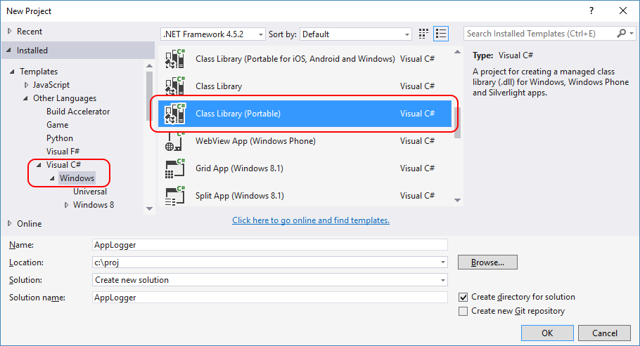
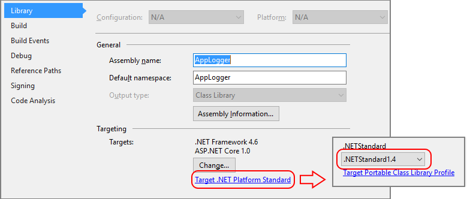

# Create .NET Standard and .NET Framework packages with Visual Studio 2015

**Note:** Visual Studio 2017 is recommended for developing .NET Standard libraries. Visual Studio 2015 can work but the .NET Core tooling was brought only to Preview state. See [Create and publish a package with Visual Studio 2017](../quickstart/create-and-publish-a-package-using-visual-studio.md) for working with NuGet 4.x+ and Visual Studio 2017.

The [.NET Standard Library](/dotnet/articles/standard/library) is a formal specification of .NET APIs intended to be available on all .NET runtimes, thus establishing greater uniformity in the .NET ecosystem. The .NET Standard Library defines a uniform set of BCL (Base Class Library) APIs for all .NET platforms to implement, independent of workload. It enables developers to produce code that is usable across all .NET runtimes, and reduces if not eliminates platform-specific conditional compilation directives in shared code.

This guide walks you through creating a NuGet package targeting .NET Standard Library 1.4 or a package targeting .NET Framework 4.6. A .NET Standard 1.4 library works across .NET Framework 4.6.1, Universal Windows Platform 10, .NET Core, and Mono/Xamarin. For details, see the [.NET Standard mapping table](/dotnet/standard/net-standard#net-implementation-support) (.NET documentation). You can choose other version of the .NET Standard Library if you want.

## Prerequisites

1. Visual Studio 2015 Update 3
1. (.NET Standard only) [.NET Core SDK](https://www.microsoft.com/net/download/)
1. NuGet CLI. Download the latest version of nuget.exe from [nuget.org/downloads](https://nuget.org/downloads), saving it to a location of your choice. Then add that location to your PATH environment variable if it isn't already.

    > [!Note]
    > nuget.exe is the CLI tool itself, not an installer, so be sure to save the downloaded file from your browser instead of running it.

## Create the class library project

1. In Visual Studio, **File > New > Project**, expand the **Visual C# > Windows** node, select **Class Library (Portable)**, change the name to AppLogger, and select **OK**.

    

1. In the **Add Portable Class Library** dialog that appears, select the options for `.NET Framework 4.6` and `ASP.NET Core 1.0`. (If targeting .NET Framework, you can select whichever options are appropriate.)

1. If targeting .NET Standard, right-click the `AppLogger (Portable)` in Solution Explorer, select **Properties**, select the **Library** tab, then select  **Target .NET Platform Standard** in the **Targeting** section. This action prompts for confirmation, after which you can select `.NET Standard 1.4` (or another available version) from the drop down:

    

1. Click on the **Build** tab, change the **Configuration** to `Release`, and check the box for **XML documentation file**.

1. Add your code to the component, for example:

    ```cs
    namespace AppLogger
    {
        public class Logger
        {
            public void Log(string text)
            {
                Console.WriteLine(text);
            }
        }
    }
    ```

1. Set the configuration to Release, build the project, and check that DLL and XML files are produced within the `bin\Release` folder.

## Create and update the .nuspec file

1. Open a command prompt, navigate to the folder containing `AppLogger.csproj` folder (one level below where the `.sln` file is), and run the NuGet `spec` command to create the initial `AppLogger.nuspec` file:

    ```cli
    nuget spec
    ```

1. Open `AppLogger.nuspec` in an editor and update it to match the following, replacing YOUR_NAME with an appropriate value. The `<id>` value, specifically, must be unique across nuget.org (see the naming conventions described in [Creating a package](../create-packages/creating-a-package.md#choosing-a-unique-package-identifier-and-setting-the-version-number). Also note that you must also update the author and description tags or you get an error during the packing step.

    ```xml
    <?xml version="1.0"?>
    <package >
        <metadata>
        <id>AppLogger.YOUR_NAME</id>
        <version>1.0.0</version>
        <title>AppLogger</title>
        <authors>YOUR_NAME</authors>
        <owners>YOUR_NAME</owners>
        <requireLicenseAcceptance>false</requireLicenseAcceptance>
        <description>Awesome application logging utility</description>
        <releaseNotes>First release</releaseNotes>
        <copyright>Copyright 2018 (c) Contoso Corporation. All rights reserved.</copyright>
        <tags>logger logging logs</tags>
        </metadata>
    </package>
    ```

1. Add reference assemblies to the `.nuspec` file, namely the library's DLL and the IntelliSense XML file:

    If targeting .NET Standard, the entries appear similar to the following:

    ```xml
    <!-- Insert below <metadata> element -->
    <files>
        <file src="bin\Release\AppLogger.dll" target="lib\netstandard1.4\AppLogger.dll" />
        <file src="bin\Release\AppLogger.xml" target="lib\netstandard1.4\AppLogger.xml" />
    </files>
    ```

    If targeting .NET Framework, the entries appear similar to the following:

    ```xml
    <!-- Insert below <metadata> element -->
    <files>
        <file src="bin\Release\AppLogger.dll" target="lib\net46\AppLogger.dll" />
        <file src="bin\Release\AppLogger.xml" target="lib\net46\AppLogger.xml" />
    </files>
    ```

1. Right-click the solution and select **Build Solution** to generate all the files for the package.

### Declaring dependencies

If you have any dependencies on other NuGet packages, list those in the manifest's `<dependencies>` element with `<group>` elements. For example, to declare a dependency on NewtonSoft.Json 8.0.3 or above, add the following:

```xml
<!-- Insert within the <metadata> element -->
<dependencies>
    <group targetFramework="uap">
        <dependency id="Newtonsoft.Json" version="8.0.3" />
    </group>
</dependencies>
```

The syntax of the *version* attribute here indicates that version 8.0.3 or above is acceptable. To specify different version ranges, refer to [Package versioning](../reference/package-versioning.md).

### Adding a readme

Create your `readme.txt` file, place it in the project root folder, and refer to it in the `.nuspec` file:

```xml
<?xml version="1.0"?>
<package >
    <metadata>...
    </metadata>
    <files>
    <file src="readme.txt" target="" />
    </files>
</package>
```

Visual Studio display `readme.txt` when the package is installed into a project. The file is not shown when installed into .NET Core projects, or for packages that are installed as a dependency.

## Package the component

With the completed `.nuspec` referencing all the files you need to include in the package, you're ready to run the `pack` command:

```cli
nuget pack AppLogger.nuspec
```

This generates `AppLogger.YOUR_NAME.1.0.0.nupkg`. Opening this file in a tool like the [NuGet Package Explorer](https://github.com/NuGetPackageExplorer/NuGetPackageExplorer) and expanding all the nodes, you see the following contents (shown for .NET Standard):


> [!Tip]
> A `.nupkg` file is just a ZIP file with a different extension. You can also examine package contents, then, by changing `.nupkg` to `.zip`, but remember to restore the extension before uploading a package to nuget.org.

To make your package available to other developers, follow the instructions on [Publish a package](../create-packages/publish-a-package.md).

Note that `pack` requires Mono 4.4.2 on Mac OS X and does not work on Linux systems. On a Mac, you must also convert Windows pathnames in the `.nuspec` file to Unix-style paths.

## Related topics

- [.nuspec reference](../reference/nuspec.md)
- [Supporting multiple .NET framework versions](../create-packages/supporting-multiple-target-frameworks.md)
- [Include MSBuild props and targets in a package](../create-packages/creating-a-package.md#including-msbuild-props-and-targets-in-a-package)
- [Creating localized packages](../create-packages/creating-localized-packages.md)
- [Symbol packages](../create-packages/symbol-packages.md)
- [Package versioning](../reference/package-versioning.md)
- [.NET Standard Library documentation](/dotnet/articles/standard/library)
- [Porting to .NET Core from .NET Framework](/dotnet/articles/core/porting/index)
