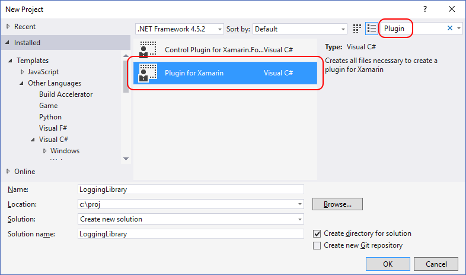
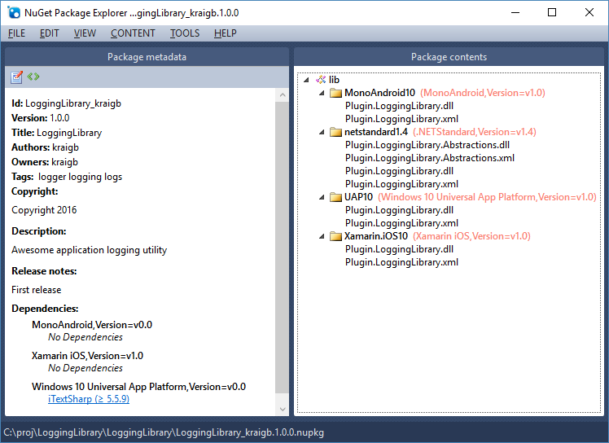

# Create packages for Xamarin with Visual Studio 2015

A package for Xamarin contains code that uses native APIs on iOS, Android, and Windows, depending on the run-time operating system. Although this is straightforward to do, it's preferable to let developers consume the package from a PCL or .NET Standard libraries through a common API surface area.

In this walkthrough you use Visual Studio 2015 create a cross-platform NuGet package that can be used in mobile projects on iOS, Android, and Windows.

1. [Prerequisites](#prerequisites)
1. [Create the project structure and abstraction code](#create-the-project-structure-and-abstraction-code)
1. [Write your platform-specific code](#write-your-platform-specific-code)
1. [Create and update the .nuspec file](#create-and-update-the-nuspec-file)
1. [Package the component](#package-the-component)
1. [Related topics](#related-topics)

## Prerequisites

1. Visual Studio 2015 with Universal Windows Platform (UWP) and Xamarin. Install the Community edition for free from [visualstudio.com](https://www.visualstudio.com/); you can use the Professional and Enterprise editions as well, of course. To include UWP and Xamarin tools, select a Custom install and check the appropriate options.
1. NuGet CLI. Download the latest version of nuget.exe from [nuget.org/downloads](https://nuget.org/downloads), saving it to a location of your choice. Then add that location to your PATH environment variable if it isn't already.

> [!Note]
> nuget.exe is the CLI tool itself, not an installer, so be sure to save the downloaded file from your browser instead of running it.

## Create the project structure and abstraction code

1. Download and run the [Plugin for Xamarin Templates extension](https://marketplace.visualstudio.com/items?itemName=vs-publisher-473885.PluginForXamarinTemplates) for Visual Studio. These templates will make it easy to create the necessary project structure for this walkthrough.
1. In Visual Studio, **File > New > Project**, search for `Plugin`, select the **Plugin for Xamarin** template, change the name to LoggingLibrary, and click OK.

    

The resulting solution contains two PCL projects, along with a variety of platform-specific projects:

- The PCL named `Plugin.LoggingLibrary.Abstractions (Portable)`, defines the public interface (the API surface area) of the component, in this case the `ILoggingLibrary` interface contained in the ILoggingLibrary.cs file. This is where you define the interface to your library.
- The other PCL, `Plugin.LoggingLibrary (Portable)`, contains code in CrossLoggingLibrary.cs that will locate a platform-specific implementation of the abstract interface at run time. You typically don't need to modify this file.
- The platform-specific projects, such as `Plugin.LoggingLibrary.Android`, each contain contain a native implementation of the interface in their respective LoggingLibraryImplementation.cs files. This is where you build out your library's code.

By default, the ILoggingLibrary.cs file of the Abstractions project contains an interface definition, but no methods. For the purposes of this walkthrough, add a `Log` method as follows:

```cs
using System;

namespace Plugin.LoggingLibrary.Abstractions
{
    /// <summary>
    /// Interface for LoggingLibrary
    /// </summary>
    public interface ILoggingLibrary
    {
        /// <summary>
        /// Log a message
        /// </summary>
        void Log(string text);
    }
}
```

## Write your platform-specific code

To implement a platform-specific implementation of the `ILoggingLibrary` interface and its methods, do the following:

1. Open the `LoggingLibraryImplementation.cs` file of each platform project and add the necessary code. For example (using the `Plugin.LoggingLibrary.Android` project):

    ```cs
    using Plugin.LoggingLibrary.Abstractions;
    using System;

    namespace Plugin.LoggingLibrary
    {
        /// <summary>
        /// Implementation for Feature
        /// </summary>
        public class LoggingLibraryImplementation : ILoggingLibrary
        {
            /// <summary>
            /// Log a message
            /// </summary>
            public void Log(string text)
            {
                throw new NotImplementedException("Called Log on Android");
            }
        }
    }
    ```

1. Repeat this implementation in the projects for each platform you want to support.
1. Right-click the iOS project, select **Properties**, click the **Build** tab, and remove "\iPhone" from the **Output path** and **XML documentation file** settings. This is just for later convenience in this walkthrough. Save the file when done.
1. Right-click the solution, select **Configuration Manager...**, and check the **Build** boxes for the PCLs and each platform you're supporting.
1. Right-click the solution and select **Build Solution** to check your work and produce the artifacts that you package next. If you get errors about missing references, right-click the solution, select **Restore NuGet Packages** to install dependencies, and rebuild.

> [!Note]
> To build for iOS you need a networked Mac connected to Visual Studio as described on [Introduction to Xamarin.iOS for Visual Studio](https://developer.xamarin.com/guides/ios/getting_started/installation/windows/introduction_to_xamarin_ios_for_visual_studio/). If you don't have a Mac available, clear the iOS project in the configuration manager (step 3 above).

## Create and update the .nuspec file

1. Open a command prompt, navigate to the `LoggingLibrary` folder that's one level below where the `.sln` file is, and run the NuGet `spec` command to create the initial `Package.nuspec` file:

    ```cli
    nuget spec
    ```

1. Rename this file to `LoggingLibrary.nuspec` and open it in an editor.
1. Update the file to match the following, replacing YOUR_NAME with an appropriate value. The `<id>` value, specifically, must be unique across nuget.org (see the naming conventions described in [Creating a package](../create-packages/creating-a-package.md#choosing-a-unique-package-identifier-and-setting-the-version-number)). Also note that you must also update the author and description tags or you get an error during the packing step.

    ```xml
    <?xml version="1.0"?>
    <package >
        <metadata>
        <id>LoggingLibrary.YOUR_NAME</id>
        <version>1.0.0</version>
        <title>LoggingLibrary</title>
        <authors>YOUR_NAME</authors>
        <owners>YOUR_NAME</owners>
        <requireLicenseAcceptance>false</requireLicenseAcceptance>
        <description>Awesome application logging utility</description>
        <releaseNotes>First release</releaseNotes>
        <copyright>Copyright 2016</copyright>
        <tags>logger logging logs</tags>
        </metadata>
    </package>
    ```

> [!Tip]
> You can suffix your package version with `-alpha`, `-beta` or `-rc` to mark your package as pre-release, check [Pre-release versions](../create-packages/prerelease-packages.md) for more information about pre-release versions.

### Add reference assemblies

To include platform-specific reference assemblies, add the following to the `<files>` element of `LoggingLibrary.nuspec` as appropriate for your supported platforms:

```xml
<!-- Insert below <metadata> element -->
<files>
    <!-- Cross-platform reference assemblies -->
    <file src="Plugin.LoggingLibrary\bin\Release\Plugin.LoggingLibrary.dll" target="lib\netstandard1.4\Plugin.LoggingLibrary.dll" />
    <file src="Plugin.LoggingLibrary\bin\Release\Plugin.LoggingLibrary.xml" target="lib\netstandard1.4\Plugin.LoggingLibrary.xml" />
    <file src="Plugin.LoggingLibrary.Abstractions\bin\Release\Plugin.LoggingLibrary.Abstractions.dll" target="lib\netstandard1.4\Plugin.LoggingLibrary.Abstractions.dll" />
    <file src="Plugin.LoggingLibrary.Abstractions\bin\Release\Plugin.LoggingLibrary.Abstractions.xml" target="lib\netstandard1.4\Plugin.LoggingLibrary.Abstractions.xml" />

    <!-- iOS reference assemblies -->
    <file src="Plugin.LoggingLibrary.iOS\bin\Release\Plugin.LoggingLibrary.dll" target="lib\Xamarin.iOS10\Plugin.LoggingLibrary.dll" />
    <file src="Plugin.LoggingLibrary.iOS\bin\Release\Plugin.LoggingLibrary.xml" target="lib\Xamarin.iOS10\Plugin.LoggingLibrary.xml" />

    <!-- Android reference assemblies -->
    <file src="Plugin.LoggingLibrary.Android\bin\Release\Plugin.LoggingLibrary.dll" target="lib\MonoAndroid10\Plugin.LoggingLibrary.dll" />
    <file src="Plugin.LoggingLibrary.Android\bin\Release\Plugin.LoggingLibrary.xml" target="lib\MonoAndroid10\Plugin.LoggingLibrary.xml" />

    <!-- UWP reference assemblies -->
    <file src="Plugin.LoggingLibrary.UWP\bin\Release\Plugin.LoggingLibrary.dll" target="lib\UAP10\Plugin.LoggingLibrary.dll" />
    <file src="Plugin.LoggingLibrary.UWP\bin\Release\Plugin.LoggingLibrary.xml" target="lib\UAP10\Plugin.LoggingLibrary.xml" />
</files>
```

> [!Note]
> To shorten the names of the DLL and XML files, right-click on any given project, select the **Library** tab, and change the assembly names.

### Add dependencies

If you have specific dependencies for native implementations, use the `<dependencies>` element with `<group>` elements to specify them, for example:

```xml
<!-- Insert within the <metadata> element -->
<dependencies>
    <group targetFramework="MonoAndroid">
        <!--MonoAndroid dependencies go here-->
    </group>
    <group targetFramework="Xamarin.iOS10">
        <!--Xamarin.iOS10 dependencies go here-->
    </group>
    <group targetFramework="uap">
        <!--uap dependencies go here-->
    </group>
</dependencies>
```

For example, the following would set iTextSharp as a dependency for the UAP target:

```xml
<dependencies>
    <group targetFramework="uap">
        <dependency id="iTextSharp" version="5.5.9" />
    </group>
</dependencies>
```

### Final .nuspec

Your final `.nuspec` file should now look like the following, where again YOUR_NAME should be replaced with an appropriate value:

```xml
<?xml version="1.0"?>
<package >
    <metadata>
    <id>LoggingLibrary.YOUR_NAME</id>
    <version>1.0.0</version>
    <title>LoggingLibrary</title>
    <authors>YOUR_NAME</authors>
    <owners>YOUR_NAME</owners>
    <requireLicenseAcceptance>false</requireLicenseAcceptance>
    <description>Awesome application logging utility</description>
    <releaseNotes>First release</releaseNotes>
    <copyright>Copyright 2016</copyright>
    <tags>logger logging logs</tags>
        <dependencies>
        <group targetFramework="MonoAndroid">
            <!--MonoAndroid dependencies go here-->
        </group>
        <group targetFramework="Xamarin.iOS10">
            <!--Xamarin.iOS10 dependencies go here-->
        </group>
        <group targetFramework="uap">
            <dependency id="iTextSharp" version="5.5.9" />
        </group>
    </dependencies>
    </metadata>
    <files>
        <!-- Cross-platform reference assemblies -->
        <file src="Plugin.LoggingLibrary\bin\Release\Plugin.LoggingLibrary.dll" target="lib\netstandard1.4\Plugin.LoggingLibrary.dll" />
        <file src="Plugin.LoggingLibrary\bin\Release\Plugin.LoggingLibrary.xml" target="lib\netstandard1.4\Plugin.LoggingLibrary.xml" />
        <file src="Plugin.LoggingLibrary.Abstractions\bin\Release\Plugin.LoggingLibrary.Abstractions.dll" target="lib\netstandard1.4\Plugin.LoggingLibrary.Abstractions.dll" />
        <file src="Plugin.LoggingLibrary.Abstractions\bin\Release\Plugin.LoggingLibrary.Abstractions.xml" target="lib\netstandard1.4\Plugin.LoggingLibrary.Abstractions.xml" />

        <!-- iOS reference assemblies -->
        <file src="Plugin.LoggingLibrary.iOS\bin\Release\Plugin.LoggingLibrary.dll" target="lib\Xamarin.iOS10\Plugin.LoggingLibrary.dll" />
        <file src="Plugin.LoggingLibrary.iOS\bin\Release\Plugin.LoggingLibrary.xml" target="lib\Xamarin.iOS10\Plugin.LoggingLibrary.xml" />

        <!-- Android reference assemblies -->
        <file src="Plugin.LoggingLibrary.Android\bin\Release\Plugin.LoggingLibrary.dll" target="lib\MonoAndroid10\Plugin.LoggingLibrary.dll" />
        <file src="Plugin.LoggingLibrary.Android\bin\Release\Plugin.LoggingLibrary.xml" target="lib\MonoAndroid10\Plugin.LoggingLibrary.xml" />

        <!-- UWP reference assemblies -->
        <file src="Plugin.LoggingLibrary.UWP\bin\Release\Plugin.LoggingLibrary.dll" target="lib\UAP10\Plugin.LoggingLibrary.dll" />
        <file src="Plugin.LoggingLibrary.UWP\bin\Release\Plugin.LoggingLibrary.xml" target="lib\UAP10\Plugin.LoggingLibrary.xml" />
    </files>
</package>
```

## Package the component

With the completed `.nuspec` referencing all the files you need to include in the package, you're ready to run the `pack` command:

```cli
nuget pack LoggingLibrary.nuspec
```

This will generate `LoggingLibrary.YOUR_NAME.1.0.0.nupkg`. Opening this file in a tool like the [NuGet Package Explorer](https://github.com/NuGetPackageExplorer/NuGetPackageExplorer) and expanding all the nodes, you see the following contents:



> [!Tip]
> A `.nupkg` file is just a ZIP file with a different extension. You can also examine package contents, then, by changing `.nupkg` to `.zip`, but remember to restore the extension before uploading a package to nuget.org.

To make your package available to other developers,  follow the instructions on [Publish a package](../create-packages/publish-a-package.md).

## Related topics

- [Nuspec Reference](../reference/nuspec.md)
- [Symbol packages](../create-packages/symbol-packages.md)
- [Package versioning](../reference/package-versioning.md)
- [Supporting Multiple .NET Framework Versions](../create-packages/supporting-multiple-target-frameworks.md)
- [Including MSBuild props and targets in a package](../create-packages/creating-a-package.md#including-msbuild-props-and-targets-in-a-package)
- [Creating Localized Packages](../create-packages/creating-localized-packages.md)