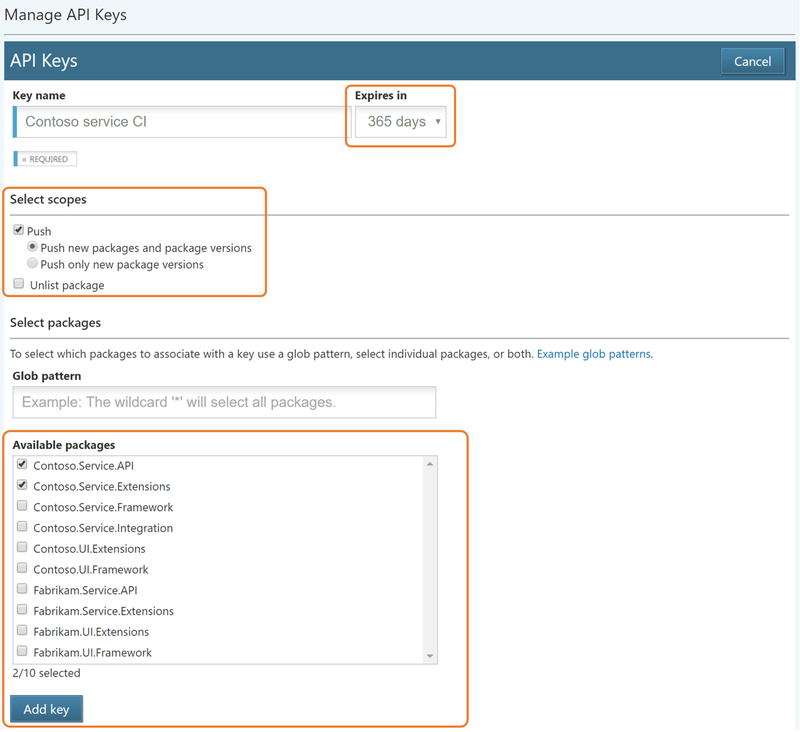
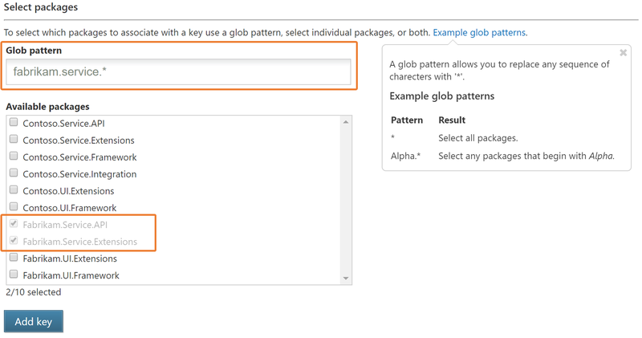
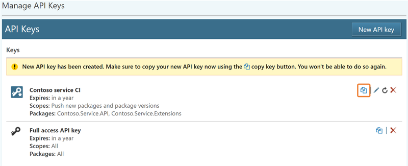

# Scoped API keys

To make NuGet a more secure environment for package distribution, you can take control of the API keys that you use to push packages.

## Feature summary

The ability to provide scope to your API keys give you better control on your APIs. You can:

- Create multiple scoped API keys that can be used for different packages with varying expiration timeframes.
- Obtain API keys securely.
- Edit existing API keys to change package applicability.
- Refresh or delete existing API keys without hampering operations using other keys.

## Why do we support scoped API keys?

We support scopes for API keys to allow you to have more fine-grained permissions. Previously, NuGet offered a single API key for an account, and that approach had several drawbacks:

- **One API key to control all packages**. With a single API key that is used to manage all packages, it is difficult to securely share the key when multiple developers are involved with different packages, and when they share a publisher account.
- **All permissions or none**. Anyone with access to the API key has all permissions (publish, push and un-list) on the packages. This is often not desirable in a multiple team environment.
- **Single point of failure**. A single API key also means a single point of failure. If the key is compromised, all packages associated with the account could potentially be compromised. Refreshing the API key is the only way to plug the leak and avoid an interruption to your CI/CD workflow. In addition, there may be cases when you want to revoke access to the API key for an individual (for example, when an employee leaves the organization). There isn’t a clean way to handle this today.

With scoped API keys, we try to address these problems while making sure that none of the existing workflows break.

## Create scoped API keys

You can now create multiple API keys based on your requirements. An API key can apply to one or more packages, have varying scopes that grant specific privileges, and have an expiration date associated with it.

In the screenshot above, you can have an API key named ‘Contoso service CI’ that can be used to push packages for certain ‘Contoso.Service’ packages, and is valid for 365 days. This is a typical scenario where different teams within the same organization work on different packages and the members of the team are provided the key which grants them privileges only on the package they are working on. The expiration serves as a mechanism to prevent stale or forgotten keys.

## Using glob patterns

If you are working on multiple packages and have a large list of packages to manage, you may choose to use globbing patterns to select multiple packages together. For example, if you wish to grant some key certain scopes on all packages whose ID starts with Fabrikam.Service, you could do so by specifying “fabrikam.service.*” in the Glob pattern text box.

Using glob patterns to determine API key permissions will also apply to new packages matching the glob pattern. For example, if you try to push a new package named ‘Fabrikam.Service.Framework’, you can do so with the key you would have created in the above step, since the package matches the glob pattern “fabrikam.service*”

## Obtain API keys securely

For security, a newly created key is never shown on the screen and is only available with the copy button. Similarly, it will not be accessible again after the page is refreshed.

## Edit existing API keys

Another use case is being able to update the key permissions and scopes without changing the key itself. If you have a key with specific scope(s) for a single package, you may choose to apply the same scope(s) on one or many other packages.

## Refresh or delete existing API keys

The account owner can choose to refresh the key, in which case the permission (on packages), scope and expiry remain the same but a new key is issued making the old key unusable. This is helpful in dealing with stale keys or where there is any potential of an API key leakage.

You can also choose to delete these keys if they are not needed anymore. Deletion will remove the key and make it unusable.

## FAQs

### What happens to my old (legacy) API key?

Your old API key (legacy) continues to work and can work as long as you want it to work. However, as was the case before, these keys will be retired if they have not been used for more than 365 days to push a package. Refer to the blog post changes expiring to API keys for more details. You can no longer refresh this key. You need to delete the legacy key and create a new scoped key, instead.

> [!Note]
> This key has all permissions on all the packages and it never expires. You should consider deleting this key and creating new keys with scoped permissions and definite expiry.

### How many API keys can I create?

There is no limit on the number of API keys you can create. However, we advise you to keep it to a manageable count so that you do not end up having many stale keys with no knowledge of where and who is using them.

### Can I delete my legacy API key or discontinue using now?

Yes. You can, and you probably should. We recommend you delete the legacy API key and start using the new key(s) as soon as we move this feature into our production service (this feature is currently only present in our staging environment).

### Can I get back my API key that I deleted by mistake?

No. Once deleted, you can only create new keys. There is no recovery possible for accidently deleted keys.

### Does the old API key continue to work upon API key refresh?

No. Once you refresh a key, a new key gets generated that has the same scope, permission and expiry as the old one. The old key ceases to exist.

### Can I give more permissions to an existing API key?

You cannot modify the scope but you can edit the package list it is applicable to.

### How do I know if any of my keys expired or getting expired?

If any key expires, we will let you know through a warning message at the top of the page. We also send a warning e-mail to the account holder 10 days before the expiration of the key so that you can act on it well in advance.