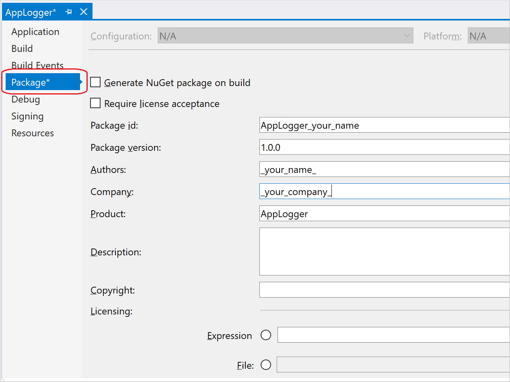
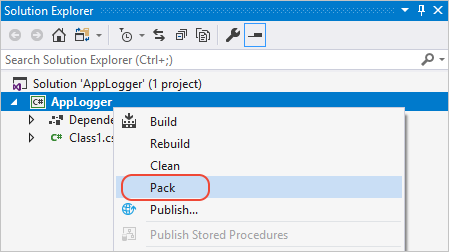

# Quickstart: Create and publish a NuGet package using Visual Studio (.NET Standard, Windows only)

It's a simple process to create a NuGet package from a .NET Standard Class Library in Visual Studio on Windows, and then publish it to nuget.org using a CLI tool.

> [!Note]
> If you are using Visual Studio for Mac, refer to [this information](/xamarin/cross-platform/app-fundamentals/nuget-multiplatform-libraries/existing-library) on creating a NuGet package, or use the [dotnet CLI tools](create-and-publish-a-package-using-the-dotnet-cli.md).

## Prerequisites

1. Install any edition of Visual Studio 2017 or higher from [visualstudio.com](https://www.visualstudio.com/) with any .NET-related workload. Visual Studio 2017 automatically includes NuGet capabilities when a .NET workload is installed.

1. Install the `dotnet` CLI.

   For the `dotnet` CLI, starting in Visual Studio 2017, the `dotnet` CLI is automatically installed with any .NET Core related workloads. Otherwise, install the [.NET Core SDK](https://www.microsoft.com/net/download/) to get the `dotnet` CLI. The `dotnet` CLI is required for .NET Standard projects that use the SDK-style format (SDK attribute). The default class library template in Visual Studio 2017 and higher, which is used in this article, uses the SDK attribute.
   
   > [!Important]
   > For this article, the `dotnet` CLI is recommended. Although you can publish any NuGet package using the `nuget.exe` CLI, some of the steps in this article are specific to SDK-style projects and the dotnet CLI. The nuget.exe CLI is used for non-SDK-style projects (typically .NET Framework). If you are using non-SDK-style project, either [migrate the project](../reference/migrate-packages-config-to-package-reference.md) and use `dotnet` CLI (described in this article), or follow the procedures in [Create and publish a .NET Framework package (Visual Studio)](create-and-publish-a-package-using-visual-studio-net-framework.md) to create and publish the package.

1. [Register for a free account on nuget.org](https://docs.microsoft.com/en-us/nuget/nuget-org/individual-accounts#add-a-new-individual-account) if you don't have one already. Creating a new account sends a confirmation email. You must confirm the account before you can upload a package.

## Create a class library project

You can use an existing .NET Standard Class Library project for the code you want to package, or create a simple one as follows:

1. In Visual Studio, choose **File > New > Project**, expand the **Visual C# > .NET Standard** node, select the "Class Library (.NET Standard)" template, name the project AppLogger, and click **OK**.

1. Right-click on the resulting project file and select **Build** to make sure the project was created properly. The DLL is found within the Debug folder (or Release if you build that configuration instead).

Within a real NuGet package, of course, you implement many useful features with which others can build applications. For this walkthrough, however, you won't write any additional code because a class library from the template is sufficient to create a package. Still, if you'd like some functional code for the package, use the following:

```cs
namespace AppLogger
{
    public class Logger
    {
        public void Log(string text)
        {
            Console.WriteLine(text);
        }
    }
}
```

> [!Tip]
> Unless you have a reason to choose otherwise, .NET Standard is the preferred target for NuGet packages, as it provides compatibility with the widest range of consuming projects.

## Configure package properties

1. Right-click the project in Solution Explorer, and choose **Properties** menu command, then select the **Package** tab.

   The **Package** tab appears only for SDK-style projects in Visual Studio, typically .NET Standard or .NET Core class library projects; if you are targeting a non-SDK style project (typically .NET Framework), either [migrate the project](../reference/migrate-packages-config-to-package-reference.md) and use `dotnet` CLI, or see [Create and publish a .NET Framework package](create-and-publish-a-package-using-visual-studio-net-framework.md) or see [Create and publish a .NET Framework package](create-and-publish-a-package-using-visual-studio-net-framework.md) instead for step-by-step instructions.

    

    > [!Note]
    > For packages built for public consumption, pay special attention to the **Tags** property, as tags help others find your package and understand what it does.

1. Give your package a unique identifier and fill out any other desired properties. For a description of the different properties, see [.nuspec file reference](../reference/nuspec.md). All of the properties here go into the `.nuspec` manifest that Visual Studio creates for the project.

    > [!Important]
    > You must give the package an identifier that's unique across nuget.org or whatever host you're using. For this walkthrough we recommend including "Sample" or "Test" in the name as the later publishing step does make the package publicly visible (though it's unlikely anyone will actually use it).
    >
    > If you attempt to publish a package with a name that already exists, you see an error.

1. Optional: to see the properties directly in the project file, right-click the project in Solution Explorer and select **Edit AppLogger.csproj**.

   This option is only available starting in Visual Studio 2017 for projects that use the SDK-style attribute. Otherwise, right-click the project and choose **Unload Project**. Then right-click the unloaded project and choose **Edit AppLogger.csproj**.

## Run the pack command

1. Set the configuration to **Release**.

1. Right click the project in **Solution Explorer** and select the **Pack** command:

    

    If you don't see the **Pack** command, your project is probably not an SDK-style project and you need to use the `nuget.exe` CLI. Either [migrate the project](../reference/migrate-packages-config-to-package-reference.md) and use `dotnet` CLI, or see [Create and publish a .NET Framework package](create-and-publish-a-package-using-visual-studio-net-framework.md) instead for step-by-step instructions.

1. Visual Studio builds the project and creates the `.nupkg` file. Examine the **Output** window for details (similar to the following), which contains the path to the package file. Note also that the built assembly is in `bin\Release\netstandard2.0` as befits the .NET Standard 2.0 target.

    ```output
    1>------ Build started: Project: AppLogger, Configuration: Release Any CPU ------
    1>AppLogger -> d:\proj\AppLogger\AppLogger\bin\Release\netstandard2.0\AppLogger.dll
    1>Successfully created package 'd:\proj\AppLogger\AppLogger\bin\Release\AppLogger.1.0.0.nupkg'.
    ========== Build: 1 succeeded, 0 failed, 0 up-to-date, 0 skipped ==========
    ```

### Alternate option: pack with MSBuild

As an alternate to using the **Pack** menu command, NuGet 4.x+ and MSBuild 15.1+ supports a `pack` target when the project contains the necessary package data. Open a command prompt, navigate to your project folder and run the following command. (You typically want to start the "Developer Command Prompt for Visual Studio" from the Start menu, as it will be configured with all the necessary paths for MSBuild.)

```cli
msbuild -t:pack -p:Configuration=Release
```

The package can then be found in the `bin\Release` folder.

For additional options with `msbuild -t:pack`, see [NuGet pack and restore as MSBuild targets](../reference/msbuild-targets.md#pack-target).

## Publish the package

Once you have a `.nupkg` file, you publish it to nuget.org using either the `nuget.exe` CLI or the `dotnet.exe` CLI along with an API key acquired from nuget.org.

[!INCLUDE [publish-notes](includes/publish-notes.md)]

### Acquire your API key

[!INCLUDE [publish-api-key](includes/publish-api-key.md)]

### Publish with dotnet nuget push (dotnet CLI)

This step is the recommended alternative to using `nuget.exe`.

Before you can publish the package, you must first open a command line.

[!INCLUDE [publish-dotnet](includes/publish-dotnet.md)]

### Publish with nuget push (nuget.exe CLI)

This step is an alternative to using `dotnet.exe`.

1. Open a command line and change to the folder containing the `.nupkg` file.

1. Run the following command, specifying your package name (unique package ID) and replacing the key value with your API key:

    ```cli
    nuget push AppLogger.1.0.0.nupkg qz2jga8pl3dvn2akksyquwcs9ygggg4exypy3bhxy6w6x6 -Source https://api.nuget.org/v3/index.json
    ```

1. nuget.exe displays the results of the publishing process:

    ```output
    Pushing AppLogger.1.0.0.nupkg to 'https://www.nuget.org/api/v2/package'...
        PUT https://www.nuget.org/api/v2/package/
        Created https://www.nuget.org/api/v2/package/ 6829ms
    Your package was pushed.
    ```

See [nuget push](../tools/cli-ref-push.md).

### Publish errors

[!INCLUDE [publish-errors](includes/publish-errors.md)]

### Manage the published package

[!INCLUDE [publish-manage](includes/publish-manage.md)]

## Adding a readme and other files

To directly specify files to include in the package, edit the project file and use the `content` property:

```xml
<ItemGroup>
  <Content Include="readme.txt">
    <Pack>true</Pack>
    <PackagePath>\</PackagePath>
  </Content>
</ItemGroup>
```

This will include a file named `readme.txt` in the package root. Visual Studio displays the contents of that file as plain text immediately after installing the package directly. (Readme files are not displayed for packages installed as dependencies). For example, here's how the readme for the HtmlAgilityPack package appears:


> [!Note]
> Merely adding the readme.txt at the project root will not result in it being included in the resulting package.

## Related topics

- [Create a Package](../create-packages/creating-a-package.md)
- [Publish a Package](../nuget-org/publish-a-package.md)
- [Pre-release Packages](../create-packages/Prerelease-Packages.md)
- [Support multiple target frameworks](../create-packages/supporting-multiple-target-frameworks.md)
- [Package versioning](../reference/package-versioning.md)
- [Creating localized packages](../create-packages/creating-localized-packages.md)
- [.NET Standard Library documentation](/dotnet/articles/standard/library)
- [Porting to .NET Core from .NET Framework](/dotnet/articles/core/porting/index)
